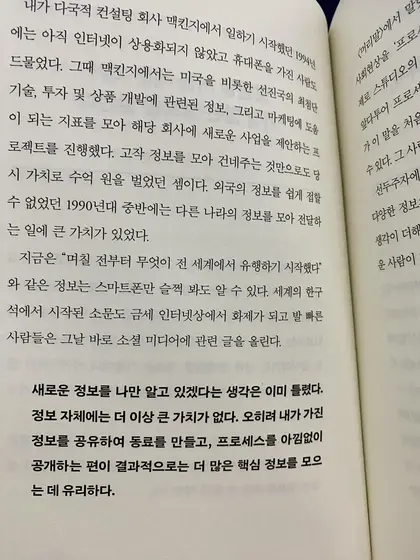
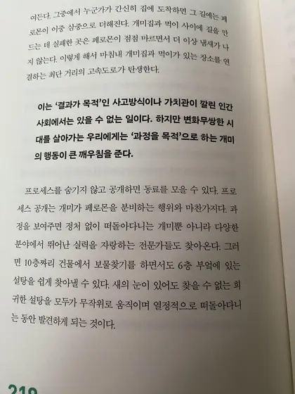

## Quality alone is no longer enough to differentiate.

We live in an age of rapid change. Information travels in the blink of an eye, and as soon as a luxury brand launches a new product, knockoffs appear.
As the author of this book says, "It's no longer enough to differentiate yourself based on quality alone.
Thanks to advances in technology, once a piece of content becomes a trend, you can expect to see a lot of copycat content reproduced.
The second coming of trots may have played a role in this trend.

Take the restaurant example. Nowadays, it seems like you can walk into any restaurant and expect to find a certain level of quality. There are many reasons for this, but from a process economy perspective, there is a lot more information on the internet about how to run a restaurant or how to make delicious food.
The quality of restaurants as a whole has improved as a result of this information being distributed to people through the internet.

If you go to YouTube right now and search for "how to do \~\~\~," you'll find dozens of videos on the subject.
As the differences between the outputs of different people gradually diminish, people start to pay attention to the process and the story.
If a brand meets a certain level of quality, they are more inclined to consume that brand because they appreciate the process and story.
This consumption pattern seems to be driven by the values of the younger generation.

## The Generation Without Desire.

This younger generation of 30-somethings and younger is referred to by the author as the "Generation Without Desire".
Based on my own example of being in my mid-twenties, I don't feel materially scarce compared to my parents' time.
Whereas our parents' era was focused on survival, ours is about achieving a higher level of fulfillment.
From this perspective, it is not a generation that does not desire, but a generation that desires different things than previous generations.
We no longer have the same one-dimensional desires for fulfillment and pleasure as previous generations.
Instead, we want to buy things that we really like, things that are produced because we can relate to the vision of the company and the life and story of the producer.

``
  They want to buy things they love, and they want to connect with the lives and stories of the producers.
  They don't just want to consume the "output." They are attracted to the act of sharing the "process."

## Jazz instead of orchestral, in a one-way fashion.

Orchestra is music of promise. All the winds and percussion instruments play to the rhythm of the conductor, according to a predetermined schedule. The writer describes orchestral performance as the epitome of right-answer attention, rushing to a set goal. Ad libs are not allowed in an orchestra.

Jazz, on the other hand, is the exact opposite. Although it follows the composer's score, the performer's performance can vary greatly depending on the mood and atmosphere of the day. The artist says that the jazz style of living and working is preferable to the orchestral style, where you don't know where the answer is and go in search of it, rather than the orchestral style, where you proceed steadily toward a set goal.

It takes too long to produce results in the uncertainty of reality. Jazz is the sum of the moment, and you have to make it up as you go along. You don't know what sound will reach the audience or what song will come out, you just enjoy singing and playing in the moment. The audience finds indescribable beauty and joy in watching the performers enjoy the process.

## The idea that I am the only one who knows new information is already wrong.

``
  Information itself no longer has much value. Rather, it's more valuable to share what you have, to make colleagues, and to open up your process to the world.
  generous disclosure of the process, which in turn helps us gather more key information.

This quote really resonated with me. My programming has also grown rapidly through this process of sharing. We all share our
problems and techniques, and we've made a lot of progress together. Sometimes I learn new information
new information while studying. Before I realized this, I used to take advantage of this gap to get ahead of others.
I did this in middle school, high school, and college. But at some point in my life, I realized that I had to stop. there is no new
information. Rather, by sharing the process of how I came to this knowledge, I was able to gain even more information as we thought about
more information. The author says

``
  A lot of attention is paid to the frontrunner. And around him, various information and people start to gather.
  As more people add their thoughts, the information multiplies. Eventually, the first person to raise the flag has the most
  the most information.

Reading this book reminded me of this fact. Information is like a snowball that grows from the first snowflake to many more.
It grows like snow as people join together to roll it around and we grow.

## How worker ants find sugar.

Life is so mysterious. How worker ants, with poor eyesight and a not-so-good sense of smell, can find sugar in the shortest distance is a process of thousands and millions of ants getting lost and reconnecting through pheromones. You can read more about it in the book. This process of the ants is exactly what the author means by process. By sharing the paths they have found, ants and we can accomplish many things together.

Overall, I felt like the book was a collection of different articles on the topic of process, rather than one big, continuous statement about process, which gave me a broad and shallow understanding of process. I could vaguely understand the process economy that the author was talking about, but I felt something was missing. However, I think this information is enough for those of us living in the present. This book is only one aspect of the process economy. By sharing the author's process, even if it is not yet a complete product, I learned a new world. If you want to know the process of one person's process in the process of life, I recommend reading this book for a short time. One thing is for sure, it will be a more interesting process to read than not to read.

 
