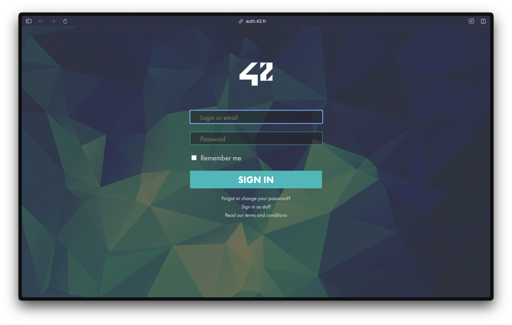
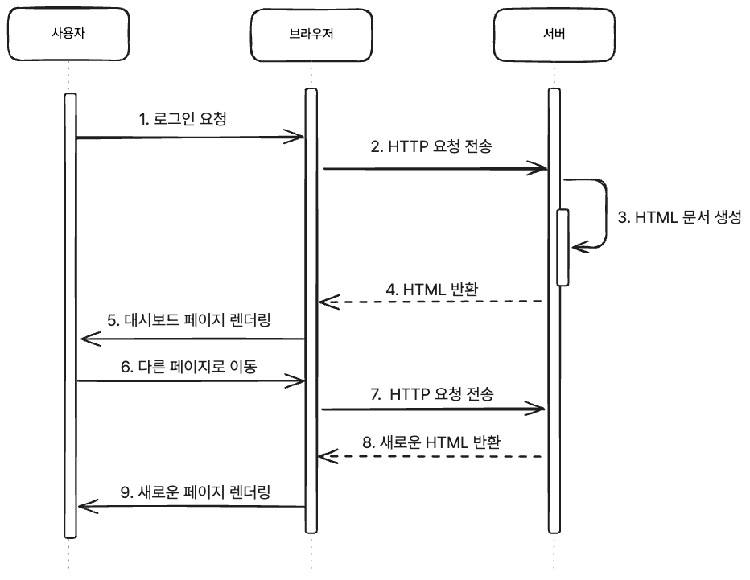
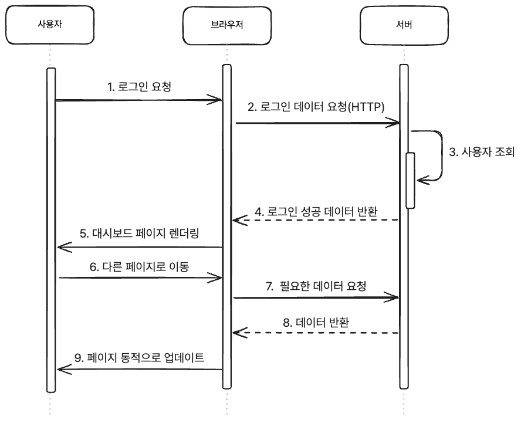
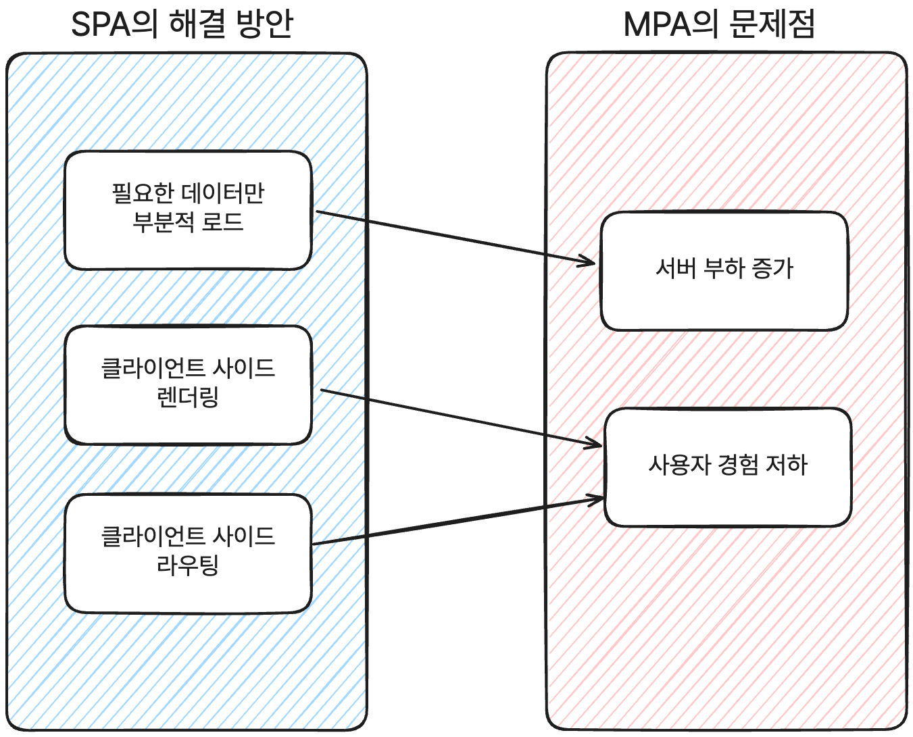

Think back to your last web surfing experience. Can you remember the last time you saw a website refresh as you moved from page to page?

Chances are, it was a while ago. The smooth, fast user experience we take for granted today wasn't taken for granted at all back then.
 Just a few years ago, web developers struggled with slow page loads and inefficient UI updates.
<strong>Single Page Application (SPA)</strong> and **React** came along to solve this problem.

Today, we'll take a look at why these two technologies came into existence and how they've changed the paradigm of web development.

## How traditional web services work (MPAs)

MPA (Multi Page Application), which means an application with multiple pages, is the traditional behavior of websites.
MPAs work based on [server-side] (https://en.wikipedia.org/wiki/Client%E2%80%93server_model#Server-side) rendering. Every time a user navigates to a page or clicks a button, the browser requests a new HTML document from the server and receives a
During this process, all static resources on the page (CSS, JS) are also reloaded and the screen is updated.  
Javascript wasn't very mature at this time, so all dynamic elements, such as showing different pages for different users, were handled on the server side. The client (browser) was simply responsible for receiving the content served by the server and rendering it on the screen.

Let's say you want to access your dashboard page using MPA, and you try to log in to the following page.

1. the user clicks the Login button.
2. The browser sends a login request to the server.
3. The server generates and delivers new HTML for the user.
4. The browser renders the HTML and displays the new page.
5. When the user navigates to another page, it requests the HTML from the server again and loads the new page.

A sequence diagram of this might look like this

Only after going through this process could we see the new page.
In the early days of websites, this was sufficient, as they consisted of static pages that had little interaction with the user and simply provided information.
However, as the web evolved and user experience and interaction became more important and complex, this approach became increasingly limiting.

For every user request, the server had to generate static resources (CSS, JS), including full HTML, to respond, causing unnecessary waste,
This resulted in excessive load on the server, which caused long loading times for users.

Ultimately, the MPA approach had the following problems

- Increased server load: The server had to generate new HTML for every request, which wasted unnecessary resources and increased server load.
- Poor user experience: Refreshes occurred every time the page was navigated and loading times were longer, degrading the user experience.

Also, from a developer perspective, there were issues with duplicate code between pages and increased complexity, which made maintenance difficult.
So a new approach was needed for a better user experience and efficient resource management, and that was SPAs. So how are SPAs different from the traditional approach?

## Single Page Application (SPA)

As the name suggests, an SPA is a single-page application. It works by rendering [client-side](https://en.wikipedia.org/wiki/Client%E2%80%93server_model#Client_side),
It works by loading the necessary HTML, CSS, and Javascript files on the first request and then dynamically updating parts of the page on subsequent requests.
Unlike MPAs, SPAs don't request new HTML from the server every time you navigate to a page, but only send data to and from the server to update the screen as needed.
This provides a fast, seamless user experience and minimizes the load on the server.

So how do SPAs work? Let's revisit the process of accessing the dashboard page we used as an example above.

1. The user clicks the Sign In button.
2. The browser sends a login request to the server.
3. The server looks up the user and sends only the user's data in response.
4. The browser updates the dashboard page based on the data sent.
5. When the user navigates to another page in the dashboard, only the necessary data is requested from the server and the UI is dynamically updated.

Representing this again as a sequence diagram, it looks like this

As you can see, unlike MPA, SPA doesn't re-render the entire HTML on the server, it only gets the data it needs from the server to update the UI on the client.
And even after that, only the necessary data is requested from the server to update the screen, improving both user experience and server load.
This is a technique that would have been possible with the advent of AJAX or better browser performance.

``
  What is AJAX?
  AJAX is a set of web development technologies that asynchronously send data to and from the server on the client side, allowing content to be updated dynamically without requiring a page refresh.
  It uses a combination of existing technologies (HTML, CSS, JavaScript, XMLHttpRequest) to decouple data and screen display, and today primarily uses JSON.
  **Ajax is not a new technology, but rather a programming concept that utilizes existing technologies in new ways.**

### Benefits of SPAs

- Fast page loading: The initial page load loads the necessary resources only once, and only the necessary data is fetched from the server thereafter.
- Smooth and fast screen transitions: Dynamically updates the page on the client without refreshing, even when the page is moved.
- Reduced server load: The server updates the UI on the client by returning only the data it needs, rather than re-rendering the entire HTML.

With these advantages, SPA solves the following problems of MPA

1. server load reduction issues

Because SPAs only request and receive the data they need from the server, they can reduce the load on the server.
The server is now only responsible for returning the data it needs instead of rendering the full HTML, resulting in simpler and faster responses.

2. Improving user experience

Pages update dynamically on the client without refreshing, even when you move around the page. Users experience smooth and fast screen transitions, and continuity of interaction is maintained.
This results in a better UX and significantly improved responsiveness.

However, SPA isn't a silver bullet. Just as there are always tradeoffs with any technology, so too is SPA.

### Cons of SPAs

- Search engine optimization (SEO) issues: Because SPAs only load the resources they need once on initial page load, and only get the data they need from the server after that, they make it harder for search engines to crawl the page.
- Initial loading speed: Because the SPA loads the necessary resources once on the initial page load, the initial loading speed can be slow.
- Issues with DOM manipulation: Because SPAs dynamically update pages on the client, DOM manipulation can be complicated.
DOM changes can also cause performance issues due to repeated reflows or repaints.

Since we're covering React in this article, let's take a closer look at the issues with DOM manipulation.

### Complexity and inefficiency of DOM manipulation

