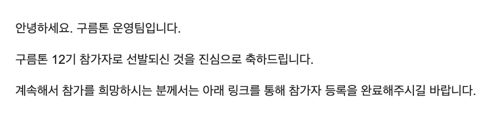
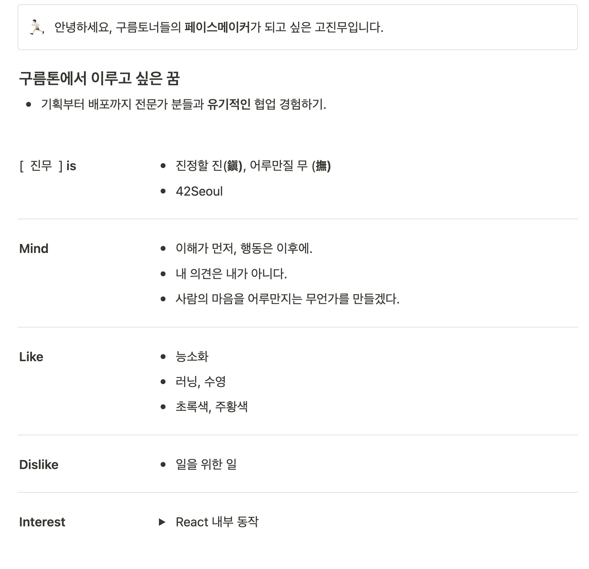
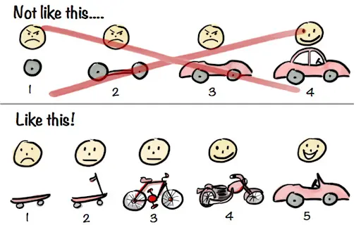
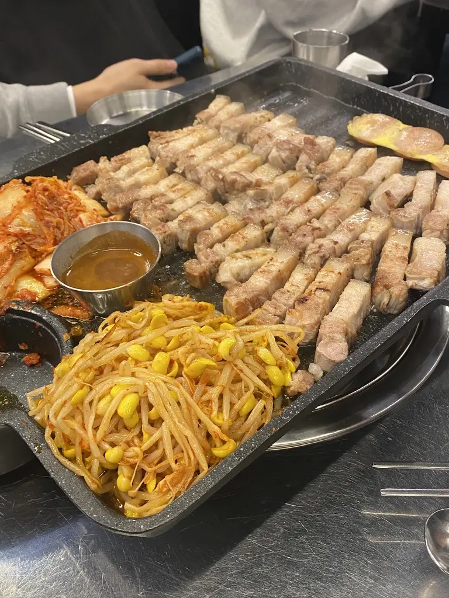
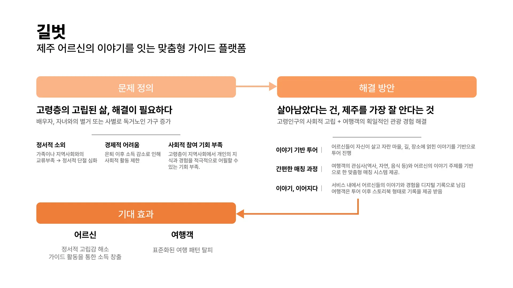
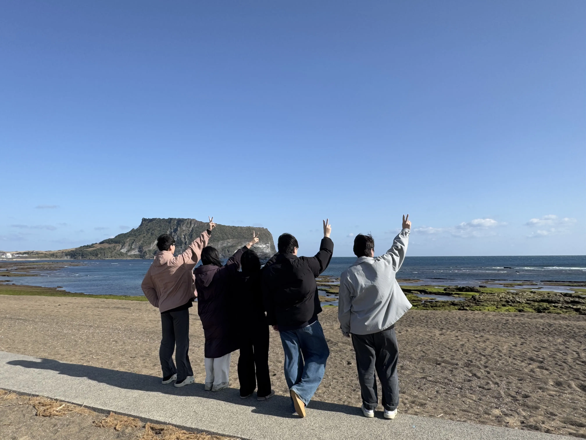
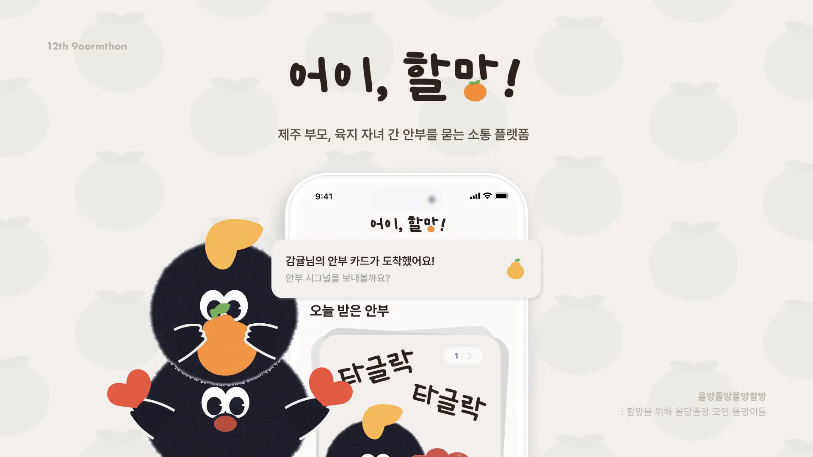

## Intro

2024.i participated as a front-end developer in the 12th edition of 9oormthon, which ran from December 10 to December 13, 2024. In this post, I'd like to write about my first hackathon experience.

in addition to my personal recap of my first hackathon, I've written this to help prospective CloudToners.

## Motivation to participate

1.  collaborating with other professions

In the process of IT service development, I wanted to understand the results of planners and designers and develop ideas together by requesting modifications or adding opinions.
conversely, I joined the program because I wanted to have the experience of explaining the problems that may arise during the programming process so that the planners and designers could understand.
at [42seoul](https://42seoul.kr), where I first learned programming, I mainly collaborated with people who worked in development or learned development, so at this Goormathon, I wanted to collaborate with people who had less understanding of development and practice explaining complex situations to them in an easy way.

2. fast and accurate product development training

in the real world, you have to set deadlines and develop products to meet them.
i joined Goomtone to train with speed and accuracy in an immersive environment.

## Complete the application

the application has a total of **5 common items** + **1 item specific to the development job**.

1. motivation to Participate
2. recent social issues facing Jeju Island
3. service ideas to solve the above issues
4. my own strengths to lead flexible collaboration.
5. goals for 'growth' in Goormathon
6. description of the project you worked on.

i focused a little more on **numbers 2, 3, and 6** of the above items in my application.

**Define the problem + provide a solution**
i thought that items 2 and 3 were presented to see the ability to solve the problem after accurately diagnosing the problem.
since many services have been developed and many plans have been made during the 12 years of Goormon, we thought that the problem definition would not be new anymore. Therefore, we spent more time on presenting service ideas to solve the problem. We thought it was more important to present ideas on how to solve this problem correctly

**Motivation and goals of the project
item 6 was to describe the projects you have worked on before.
i was going to introduce some of the projects I worked on at [42seoul](https://42seoul.kr) ([webserv](https://github.com/WebWaveMaker/webserv), [ft_transcendence](https://github.com/42ForYou/ft_transcendence), etc.), but since they all solved a given problem, I didn't think I could explain the motivation and goals of the project well. So I introduced the [obsidian-go-up](https://github.com/JinMuGo/obsidian-go-up) project, which was a simple plugin for Obsidian that was born out of a pain point I felt.
i've tried to convey as much as I can in this post about my motivation for the project and how I tried to solve it.

i received an acceptance email 4 days after submitting and was able to participate in the Goormathon.

## Schedule
here are the key events for each day

| **Day 1** |                                    **Highlighted Events**                                     |
| :-------: | :-------------------------------------------------------------------------------------------: |
| **Day 1** | - Hackathon Lecture - 3 minutes Self PR  -Ideation Topic Presentation |
| **Day 2** |      - 2min IDEATION - Team Building - Beer Party - Hackathon      |
| **Day 3** |                                    - Hackathon in progress                                    |
| **Day 4** |              - Hackathon Presentation - Results Announcement and Awards              |

### Day 0

i arrived in Jeju Island on the afternoon of December 9, the day before, and prepared to participate.

### Write a bio

i had to write a bio page on Notion because I had to give a 3-minute Self PR on the first day of Goormathon.
i'm not very good at introducing myself, so I was most afraid of the Self PR on the first day. I've had to give presentations since I was in school, and my ears and face would turn red just getting up from my seat. So I often avoided presentations, but I realized that I couldn't even convince others if I avoided it because I couldn't give a presentation. So I wanted to get better this time, so I searched for the keyword "self-presentation" in the library, read the book 18-second self-presentation [^self-pr-book], and wrote a self-presentation page based on the book and prepared for the presentation.

early in the book, the author says.
> [!note] The 18-second introduction
> An introduction is not about introducing yourself, it's about introducing the future the listener can gain from your involvement

along those lines, I wrote it in a way that introduced what the listener could get out of my experience. in other words, I made my bio about the listener, not me, so I positioned myself as the pacer of the cloud talkers and tried to convey a metaphorical message to others, "It would be great to team up with me!"

below is the bio page I wrote.

after we finished our bio pages and scripts, we went to bed.
## Day 1

day 1 consisted of Hackathon Lectures and presentations on the topics of Self PR, Identification topics were presented.

### Hackathon Lecture
 
 *hackathon with open source excitement*
 
before the Goormathon. we had a lecture that gave us an overview of how to approach a hackathon with the right mindset.

we emphasized the importance of being selective and focused, especially due to the nature of hackathons where you have to develop a product in a short time.
therefore, we introduced how to develop quickly by utilizing already developed open source or how to quickly materialize ideas by utilizing design tools such as Lean Canvas.

During the MVP development process, we emphasized the following points

- prioritizing speed over perfection: focus on implementing ideas quickly rather than developing a perfect product.
- focus on one thing rather than broader concerns: Focus on the right features (functionality) and measure the success of those features.
- agility instead of waterfall: Don't focus on process and procedure, prioritize speed with division of labor and collaboration.
- practicality, not more features: Don't boast as many features as possible, but provide specific value to users.

we realized that it was important to focus on one aspect of what we wanted to offer and deliver it well, rather than trying to develop everything.

he also told us what not to do at this hackathon, one of which was to "just work hard".
he emphasized that we shouldn't just focus on building and implementing something, but also not forgetting the context of why and how our team is doing what we are doing. This is not just for a hackathon.
i took this to heart and went into Goormathon with this in mind because it's similar to what I ultimately wanted to accomplish in this hackathon.

### Self PR

after the lecture and lunch, we gave our 3-minute bio pitches.

i presented from a script that I had memorized the day before.  i was able to break the ice and relax while listening to other people's presentations.
since it was a hackathon in Jeju Island, everyone was from so many different places, and I realized that I wouldn't have been able to meet such a diverse group of people if it was held in Seoul.
i was too nervous to listen to other people's presentations, but if I had this opportunity again, I would work harder to prepare my presentation and listen to other people's presentations more intently.

shamefully, below is my full bio.

> [!quote]+ bio
> > Hello, I'm Jinmoo Go, a front-end developer who wants to be a pacemaker for Goormonster.
>
> This Goormathon is a special opportunity for me. it is because I can team up with experts in various fields and learn together from planning to deployment. Especially, I think it will be really valuable to have the experience of understanding and communicating with planners and designers for the first time. I hope to create a meaningful time to achieve a common goal through this process.
>
> That's why I'm going to be a pacemaker in this Goormathon. a pacemaker doesn't just run ahead of the team, but also understands the status and needs of the team members and acts accordingly. I thought that the ability of a pacemaker to understand the other person and decide my behavior accordingly is also functional in Goormathon.
>
> My name is written as 'Moo to touch' on 'Jin to calm down', which means 'true Jin' is a spinner, and 'Moo to touch' is written as 'Handoja' on 'nothing', which means 'touching something that is not there', which means to touch the heart. since I became a programmer, I thought that I would spend my life creating something that touches people's hearts, and I hope to create something wonderful with you in this Goormathon. if you want to build a great team, feel free to reach out. i hope we can create a great experience together. thank you.

### Hackathon Lesson - How to Grow from a Hackathon

after the introductions, there were other hackathon lectures, which talked about how to grow from the hackathon. One that stuck out in my mind was the talk about `DONE` and `PERFECT`.

it's been said that most of us tend to perceive DONE as not being PERFECT and PERFECT as not being DONE.
in a hackathon, everyone has a different definition of DONE, so DONE and PERFECT are not polar opposites.

and between DONE and PERFECT is GROWTH. if you are currently between DONE and PERFECT, getting closer to PERFECT is called growth.

so, "PERFECTLY DONE." every moment of the hackathon. we were told to aim for perfection and go for it.

this lesson is said to be based on Chiksent Mihai's book Immersion [^1], which you might want to check out if you're interested.

### Foundation Topic Presentation
at the end of Day 1, we had our foundation theme presentation.
the theme for this 12th edition was Aging.

when I applied for a job, I took it a step further by presenting services related to aging and created a PPT.

### Wrap up Day 1

on Day 1, I went for a walk with my teammates in the middle of the day, and in the evening, I had a fun time eating black pork with other Goormoners. you don't get to go outside that much during Goormathon, so I recommend that you move around a lot from day 1. Sometimes it's hard to realize that you're in Jeju Island.

|  | 
| ---------------------- | -------------------------------- |

## Day 2

on Day 2, teams will present their ideas on the previous day's ideation topic, "Aging"
[[2-minute ideation time, team building, and beer party

### 2 minutes IDEATION

you have 2 minutes to present your idea in a one-page PPT.
i proposed a service called 'Gilbot'. *i presented a *1-minute problem definition** **1-minute solution** with a big framework.

the presentation time was short and I only had one PPT, so I was less nervous than yesterday.
afterwards, I listened to the other presentations and thought about who I would like to team up with and what ideas I would like to work on.

### Team building

team building time felt like a marketplace. there was no system, we just asked for input from whoever we wanted and formed teams.

i had a list of people I wanted to work with while listening to the ideation, and I was lucky enough to have no trouble organizing my team. if you're going to participate in a goormathon, I think it's a good idea to think about who you want to team up with and what ideas you want to work on during the team building time.
in this hackathon, we were often teamed up with people who were relatively close to each other based on their initial randomly assigned seats.

so if you have a goal or outcome you want, it's important to be proactive in moving toward it. you'll be more satisfied with the outcome if you take the initiative to make it happen than if you wait for your teammates to come to you.

that's how our team, "[**Olmangolmangolmangolmang**](https://github.com/ddol-mang)" was formed. our organizer came up with the name out of the blue, and we all liked it so much that we decided to stick with it.

a bunch of old ladies gathered together for the sake of their grandmother

after the team was formed, we had a brainstorming session to select topics that fit the theme of Jeju Island, cloud, and aging. However, it was not easy to select services that fit the theme.
we couldn't fundamentally solve the social problem of aging, so we decided to develop a service that could alleviate or solve the problems caused by aging.

however, we ended up at a beer party at 6pm with no good ideas.

### Beer Party

beyond the formed teams, we had a beer party to connect with other team members and mentors.

the beer party was based on three timetables.

1. time to chat with people sitting in randomly assigned seats (6:00-7:30)
2. free-flowing conversations at tables organized by job function - with mentor participation (7:30-9:00)
3. free time to chat with other team members (9-11)

i had one of my favorite times at this hackathon. i enjoyed talking to other people who came to Goormathon, and hearing their stories made me think about various things.
i think that if you're a goormoner participating in a goormathon, you should spend as much time at the beer party as you would at a hackathon to talk to other people and network with them to get 200% out of it.

### Decide on a topic

after the beer party, we reconvened to decide on a theme with our teammates. We had to choose a theme before we could start the hackathon tomorrow.
i think we talked about a lot of things. Services for seafarers. connecting the elderly and the young. a service using grandma and grandpa's house like a temple stay, and many other topics were discussed but dismissed for various reasons.
we chose the topic based on [a newspaper article](https://www.jejunews.com/news/articleView.html?idxno=2215293) that was published on the day of the hackathon that one of the team members found.

> [!quote]
> > In other words, the happiness of seniors is dominated by the following: their children are healthy, their children are married and living in harmony, and they continue to be as active as their bodies allow.
>
> ... (emphasis added)
>
> "Relationship with children" is more important than living standards or current life in terms of life satisfaction.
> > In short, older adults in Jeju Island have children at the center of their happiness, but they are relationship-oriented rather than dependent, explore independence and meaning in life through work, and value their children's health and happiness more than their own.
>

through the above article, we realized that there is a need for a connection between offshore parents and mainland children, and to solve this problem, we decided to develop a platform between parents and children who can communicate their current status through simple interaction.

we chose the topic because everyone on the team felt connected and excited about the issue. Personally, I was thrilled when the topic was first decided.
the process of brainstorming and fleshing out ideas was hard, but we had so much fun that we stayed up until 4am.
i was worried before the hackathon because I'm a light sleeper and a night owl, but I was so engrossed that it didn't matter.

afterwards, we decided to go to our rooms to sleep for tomorrow's hackathon. We were all nervous about oversleeping, so we shared our rooms on KakaoTalk with our teammates and went to bed.

## Day 3

after the topic was selected, we had a meeting to develop a specific service, specify the API and DB, and plan the front-end development according to the designer's screen design.

since I wasn't familiar with libraries like react-query and zustand yet, I asked another front developer to focus on the screen implementation + backend API, and I was in charge of the screen implementation + deployment environment for the front-end stage.

i noticed that our deployed service was constantly re-rendering every few seconds. I noticed the problem around 4am, and after working on it for about 2 hours, I realized that our service was running in development mode.
i realized that this was the problem and wanted to change it to production mode, but I didn't understand the crampoline (deployment environment), so I asked my mentors for help.
my intentions were simple. the service was developed with VITE and I wanted to change the service, which was originally running in development mode, to run in production mode. here's how it happened

the backend developer was not familiar with crampoline and had difficulty deploying it, so we had to find another way to spin up a static server with nginx, which is what we originally wanted to do.
so the backend guy asked his mentor for help, and that's how we ended up spinning up the frontend code in development mode (e.g. `pnpm dev`) instead of the logic of serving static files with nginx after the existing static build.
 vITE has a `preview` command to serve static files into production. it occurred to me that this wouldn't have happened if I had added a more intuitive script to the `package.json` `script` that would run into production, such as `start` instead of `preview`. It was a good reminder of the importance of abstraction.

in the meantime, the planners and designers were preparing for the presentation, and I apologize to them for not being able to participate much in the process.
by 10 o'clock the next day, the presentation preparation and development were finalized.

seongsan Sunrise Peak, which we visited during the hackathon.
and a photo with my teammates.

|  | 
| ---------------------------- | -------------------- |

## Day 4

day 4 was the hackathon announcements and awards.

### Hackathon announcement

so we pulled an all-nighter and announced "[Hey, Grandma]" (https://github.com/ddol-mang/hey-oldlady).

our pitch strategy was to appeal to the emotions of parent-child separation.
we presented the problem through news and statistics and introduced a service to solve it.

however, in the presentation feedback, you raised the question of whether the features and problem awareness we touted were **actually needed by users**.
we thought about this a lot, but we were disappointed that we didn't create enough logic to explain it.
however, we really enjoyed the fact that our service focused on user experience and **aging** and focused on a simple user flow to solve it.

## Other

it was a great time to experience and learn so much in such a short period of time, true to the values of Goormtone.

it was my first hackathon, so there were a lot of unknowns, but I met some great teammates and had a great time building memories together.
we were so immersed in the development that we forgot we had to stay up all night, and we learned a lot in the process.
personally, the first hackathon buttoned me up so well that I'm eager to participate in other hackathons.

there are many reasons to participate in a hackathon, but I think it all boils down to the **experience**. the sheer enjoyment of the process of intensely thinking through and developing ideas with my teammates at a goormathon is enough to make it worthwhile for me.

so if you're on the fence about a hackathon, don't hesitate to join one.
the networking with other cool people is a bonus.

[^self-pr-book]: [The 18-Second Self-Pitch](https://www.aladin.co.kr/shop/wproduct.aspx?ItemId=94177413)
[^1]: [Immersion](https://www.aladin.co.kr/shop/wproduct.aspx?ItemId=503603)
	
