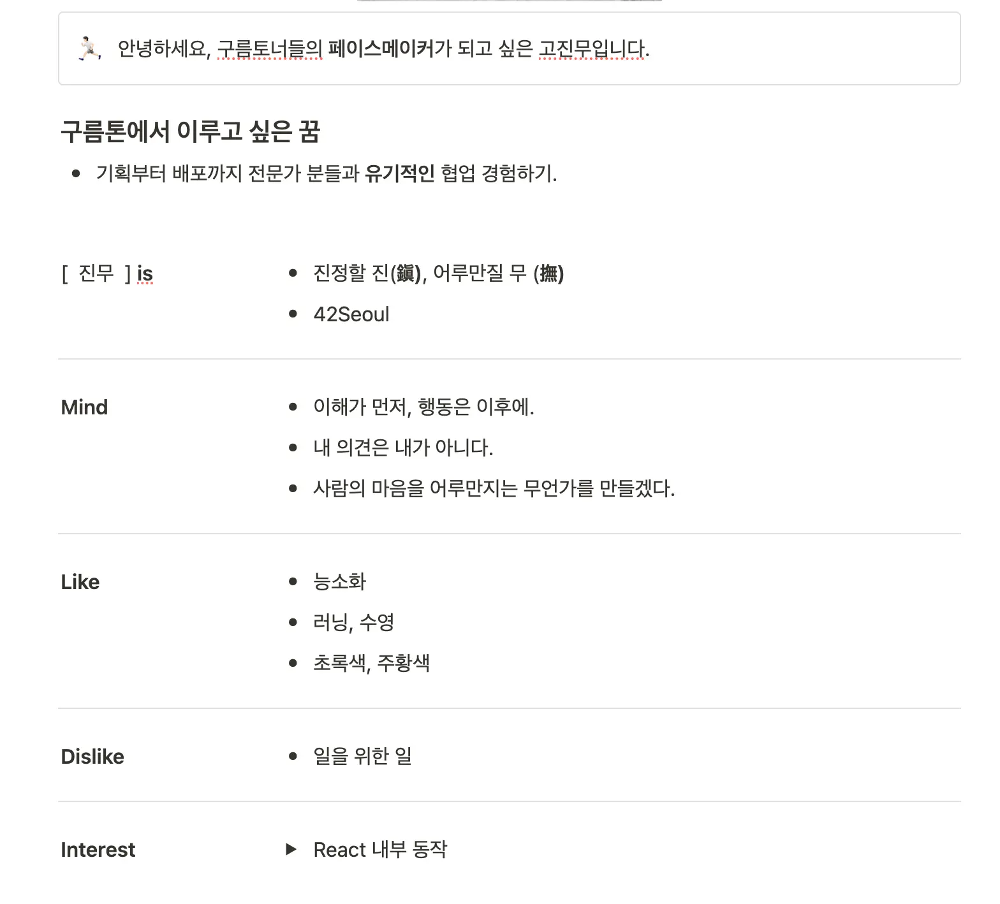

## Intro

I participated in the 12th edition of 9oormthon from December 10, 2024 to December 13, 2024 as a front-end developer.
In this post, I'm going to write about my first hackathon experience.

In addition to being a personal recap of my first hackathon, this article is intended to be helpful to prospective CloudToners.

## Motivation to participate

*"Collaborate with other professions"*.

In the process of IT service development, I wanted to understand the results of planners and designers and develop ideas together by requesting modifications or adding opinions.
On the other hand, I participated because I wanted to have the experience of explaining the problems that may arise during the programming process so that the planners and designers could understand.
At 42seoul, I mainly collaborated with people who are in development or have learned development, so I wanted to collaborate with people who have a low understanding of development at this Goormathon.

*"Fast and accurate product development training"*.

In general, accuracy and speed are inversely related. But in the real world, you have to set deadlines and develop products accordingly.
I joined Goomtone to train in an immersive environment where I could focus on both speed and accuracy.

## Complete the application

The applications had a total of 5 common items + 1 item specific to the development role.

1. Motivation for participating in Goormathon
2. Social issues facing Jeju Island in recent years
3. Service ideas to solve the above problems
4. Your strengths to lead flexible collaboration.
5. Goal for 'growth' in Goormathon
6. Description of projects you have worked on.

I focused my application a little more on points 2, 3, and 6 of the above.

In particular, for items 2 and 3, I spent more time on presenting service ideas to solve the problem, although it is important to accurately diagnose the current social problems on Jeju Island.
When I was writing the application, I thought that the definition of the problem was similar to everyone else's and that there was nothing new to say, so I thought it was more important to present ideas on how to solve the problem accurately.

Also, item 6 was to describe the projects I've worked on before, and I was going to introduce the projects I worked on at 42seoul ([webserv](https://github.com/WebWaveMaker/webserv), [ft_transcendence](https://github.com/42ForYou/ft_transcendence), etc,
I don't think I can explain the motivation and goal of the project well, so I introduced the [obsidian-go-up](https://github.com/JinMuGo/obsidian-go-up) project, which is a simple plugin for the note app Obsidian.

As much as possible, I tried to incorporate the problem definition of why I was working on this project and how I wanted to solve it into my writing.

Luckily, I passed and was able to participate in the Goormathon.

## Day 0

I arrived in Jeju Island on December 09, the day before, and prepared to participate in Goormathon.

%% 18 seconds bio post link %%

#### Write a bio

I had to create a self-presentation page on Notion because I had to present a 3-minute self-presentation on the first day of Goormathon.
I was not good at introducing myself, so I read the book 18 Second Self-Promotion [^self-pr-book], which was found by searching the keyword "self-promotion" in the library, and wrote a self-promotion page based on the book.
I will write a review of the book later.

When writing pages and preparing scripts, you'll want to use the

> [!note] 18 Second Self-Promotion
>   It's not about introducing yourself, it's about introducing the future the listener can gain from your involvement.
> 

I wanted to share my experience and how the audience could benefit from it.
I positioned myself as a pacemaker for the CloudToners and tried to convey the message that it would be great if others would "team up and collaborate!" with me.

## Day 1

Day 1 consisted of a lecture about the hackathon, introductions, and a presentation of the foundation theme.

#### Hackathon Lectures - Open Source Excitement

Before Goormathon, there was a lecture that gave us a general overview of how to approach a hackathon with the right mindset.

He emphasized the importance of choice and focus, especially given the nature of hackathons where you have to develop a product in a short time.
We talked about how to stand on the shoulders of giants, i.e., how to develop quickly by leveraging already developed open source, or how to quickly materialize ideas by utilizing design tools such as Lean Canvas.

During the MVP development process, we emphasized the following points

- Prioritizing speed over perfection: Focus on implementing ideas quickly rather than developing a perfect product.
- Focus on one thing rather than broader concerns: Focus on the right features (functionality) and measure the success of those features.
- Agility instead of waterfall: Don't focus on process and procedure, prioritize speed with division of labor and collaboration.
- Practicality, not more features: Don't boast as many features as possible, but provide specific value to users.

We felt it was important to focus on one thing that we wanted to deliver and deliver it well.
We felt it was important to dig into the core and find the wow factor.

He also told us what not to do at this hackathon, one of which was to "just work hard".
He emphasized that we shouldn't just focus on building and implementing something, but that we shouldn't forget the context of why and how our team is doing what we are doing.
This is similar to what I ultimately wanted to accomplish in this hackathon, so I took it to heart and went into Goormathon.

### Self PR

After the lecture and lunch, we had a 3-minute pitch.

I have public speaking phobia, so I memorized the script I had prepared in advance. However, the staff helped me break the ice and I was able to relax while listening to other people's presentations.
Since the hackathon was held in Jeju Island, everyone came from different places. If it was held in Seoul, I don't think I could have met such a diverse group of people.
I was too nervous to listen to other people's presentations, but if I had this opportunity again, I would work harder to prepare my presentation and listen to other people's presentations more intently.

#### Hackathon Lecture - How to Grow from a Hackathon

There was another hackathon lecture, which talked about how to grow from a hackathon.

You've been talking about DONE and PERFECT. He said that most of us
**tend to perceive DONE as not perfect and PERFECT as not done.
In a hackathon, everyone has a different definition of DONE. And he said that DONE and PERFECT are not polar opposites.

And between DONE and PERFECT is GROWTH. Growth is moving from my current state, which is between DONE and PERFECT, closer to PERFECT.

"PERFECTLY DONE." It was an announcement that resonated with me.

---

At the end of the first day, there was a presentation of the idea topic. The theme of the 12th edition was "Aging".

When I wrote my application, I was fortunate enough to present services related to aging, so I took this a bit further and created a PPT.

On the first day, we went out for a walk with the team in the middle of the day, and in the evening, we had a great time eating black pork with other goormoners.

|  | 
| ---------------------- | -------------------------------- |

## Day 2

#### 2 min IDEATION

We presented the IDEATION in a PPT for 2 minutes, and then proceeded with team building.

I proposed a service called 'Gilbot'. I simply presented a one-minute solution to a one-minute problem.

The presentation time was short and I only had one PPT, so I was less nervous than yesterday.
Afterward, I listened to other people's presentations and thought about who I would like to team up with and what ideas I would like to share.

### Team building

The team building time was like a marketplace. There was no system, everyone just asked who they wanted to be on the team and formed a team.
I had a list of people I wanted to work with beforehand, and luckily I didn't have much trouble organizing my team. If you're going to participate in Goormathon, I would recommend that you think about who you want to team up with and what ideas you want to bring to the table during the team building time.
Also, there is a certain amount of luck involved. We were often teamed up with people who were relatively close to us based on our initial randomized seats.

So if you have a goal or outcome that you want, it's important to actively work towards it. I think you'll be more satisfied with the outcome if you take the initiative to build your team than if you wait for them to come to you.

That's how our team "[**Olmangolmangolmangolmang**](https://github.com/ddol-mang)" was formed. The organizer came up with the team name out of the blue, but I really liked it.
A bunch of old ladies gathered for old ladies. It's a good name.

### Select a topic

After the team was formed, we brainstormed to select topics that fit the theme of "Jeju Island," "Cloud," and "Aging."
However, it was not easy to choose the right service for the theme.
We couldn't fundamentally solve the social problem of aging, so we decided to develop a service that could alleviate or solve the problems caused by aging.

### Beer Party

There was a beer party to connect with other team members outside of the formed team.

It was based on a total of three timetables.

1. time to chat with people sitting in randomly assigned seats (6-7:30)
2. free-form conversations at tables organized by job function - with mentor participation (7:30-9:00)
3. free time to chat with other team members (9-11)

This was by far my favorite part of the hackathon. I enjoyed talking to other people, and listening to their stories made me think about various things.
As Mr. Goormathon said, I think the best way to enjoy the hackathon is to network and enjoy the beer party as much as possible.
I left the beer party a little early because I was anxious that the topic hadn't been selected yet, but I thought that if I had this opportunity next time, I would enjoy it fully and communicate with others.

### Decide on a topic

After the beer party, we spent time with the team to decide on a theme. We had to choose a topic before we could start the hackathon.
I think we talked about a lot of things. Services for seafarers. The connection between the elderly and the young. We discussed many topics, such as services using grandparents' homes, such as temple stays.
However, we were rejected for various reasons.

The topic was inspired by a newspaper article that was published on the same day as our hackathon.

''
  In other words, the elderly person's well-being is characterized by their children being healthy, their children being married and living in harmony...(emphasis added)

  In "Life Satisfaction," "Relationship with children" has a greater impact than living standards or current life.
  In short, older adults in Jeju have their children at the center of their happiness, but they are relationship-oriented, not dependent, and they explore independence and meaning in their lives through work, and they value their children's health and happiness more than their own.

This sentence made us realize that there is a need for connectivity between offshore parents and mainland children, and to solve this problem, we decided to develop a platform between parents and children who can communicate their current status with a few simple touches.

With more and more people living away from their families, it's becoming harder to communicate with our parents.
We chose this topic because it resonated with and intrigued everyone on the team. Personally, I was thrilled when the topic was first decided.
We stayed up until 4 a.m. to discuss and refine our ideas, but it was so much fun that we lost track of time.
I was worried before the hackathon started because I'm a light sleeper and a night owl, but I was wrong.

We decided to go to our rooms and sleep for tomorrow. We all shared our rooms with our teammates on KakaoTalk and went to bed, worried that things might not go well.

## Day 3

After the topic was selected, we had a meeting to develop a specific service, specify the API and DB, and plan the front-end development according to the designer's screen design.
Since I was not yet familiar with libraries such as react-query and zustand, I asked another front-end developer to focus on the screen implementation + back-end API.
I was in charge of implementing the screen + setting up the deployment environment for the front-end unit.

When implementing screens and frontend logic, other frontend developers helped me a lot in areas where I was lacking, so I was able to develop quickly.

As we continued to develop, we noticed that our service kept re-rendering every few seconds.
I noticed the problem at around 4am and worked on it for about 2 hours, until I realized that our service was running in development mode.
I thought this was the problem and wanted to change it to production mode, but I didn't understand Crampoline, so I asked my mentors for help.
My objective was simple. Our service was developed with vite, and I wanted to change it from running in development mode to running in production mode.
Eventually, with the help of my mentors, I was able to solve the problem and no more rendering occurred. The problem was as follows

The difficulty of deploying with a crampoline meant that we had to find a way to do something other than spinning up a static server with nginx, which is what we originally wanted to do.
So the backend guy asked his mentor for help, and in the process we ended up spinning up the frontend server in development mode.
This wouldn't have happened if we had added a script in the package.json that would run in a more intuitive production mode, such as `start` instead of `preview`.
This was a good reminder of the importance of abstraction. Somehow, once I solved the problem, I was able to focus on other development.

In the meantime, the organizers and designers were preparing for the presentation. I apologized to the organizers and designers for not being able to participate much in the presentation preparation process.
It was almost 10 o'clock the next day, and I had to go back to the hotel to pack my things before 11 o'clock.

---

Seongsan Sunrise Peak on Day 3 with the team.

|  | 
| ----------------------- | -------------------- |

## Day 4

#### Hackathon announcement

We pulled an all-nighter and announced our service "[Hey, Grandma]" (https://github.com/ddol-mang/hey-oldlady).

Our presentation strategy was to appeal to the emotions of parent-child separation.
We presented the problem through news and statistics and introduced a service to solve it.

However, in the presentation feedback, you raised the question of whether the features and problem awareness that we touted were **actually needed by users**.
We thought about it a lot, but we didn't feel like we had done a good enough job of explaining our logic.

But I knew that our service was focused on the user experience, the keyword being **aging**. And I think it was meaningful to focus on a simple user flow to address this.
I was proud of our team for coming up with this in such a short time.

## Other

True to the values of Goormtone, I was able to experience and learn a lot in a very short time.

It was my first hackathon, so I had a lot of inexperience, but luckily I met a great team and had a great time making memories together.
We were so immersed in the development that we forgot to sleep at night, and we learned a lot in the process. I couldn't have done it without my team.
The first hackathon buttoned up so well that I can't wait to participate in the next one.

There are many reasons to participate in a hackathon, but I think it comes down to the experience.
The process of intensely thinking and developing ideas with my teammates is pure fun. This fact alone makes it worthwhile.
So if you're thinking about participating in a hackathon, don't hesitate to do so.

Networking with other cool people is a bonus.

[^self-pr-book]: [The 18-Second Self-Pitch] (https://www.aladin.co.kr/shop/wproduct.aspx?ItemId=94177413)