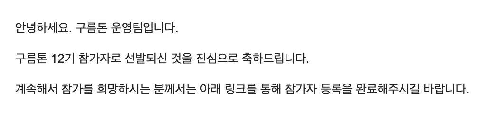
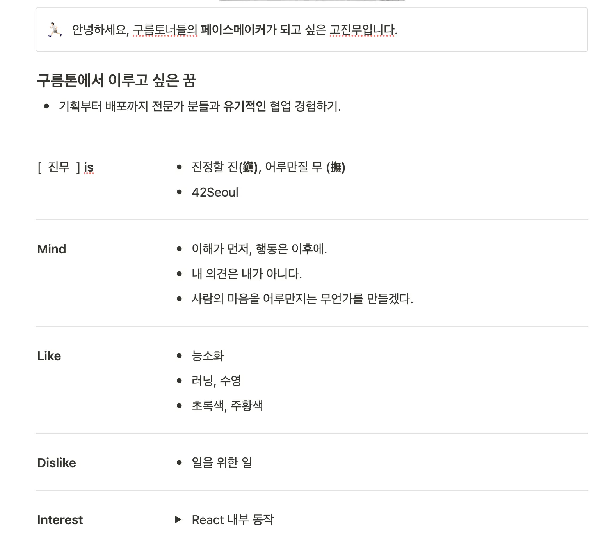
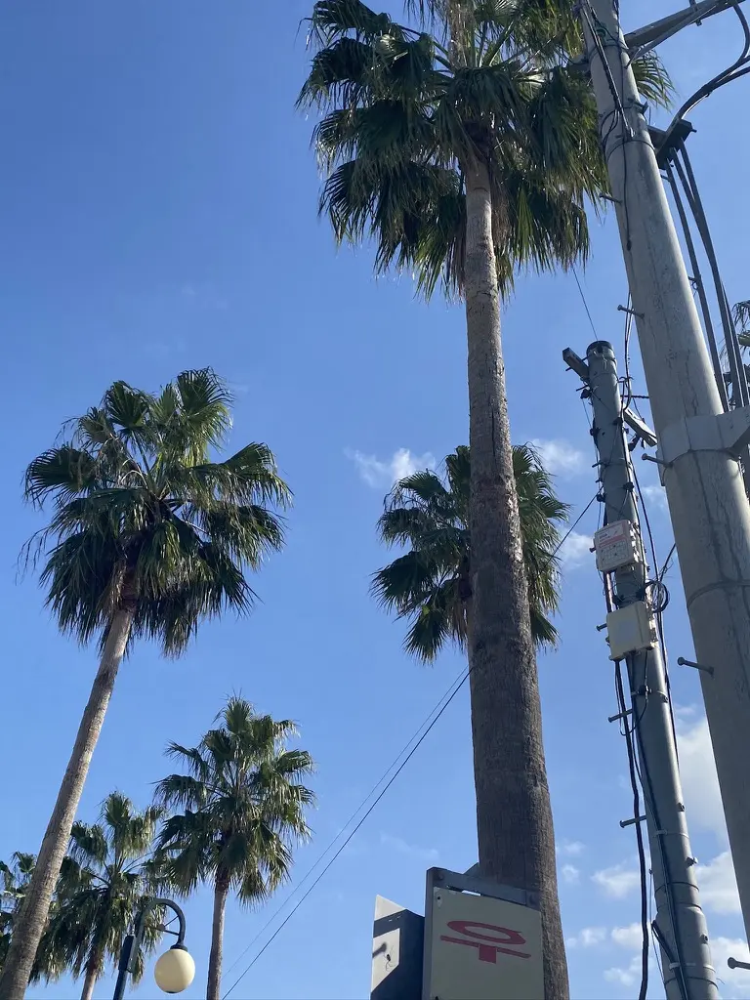
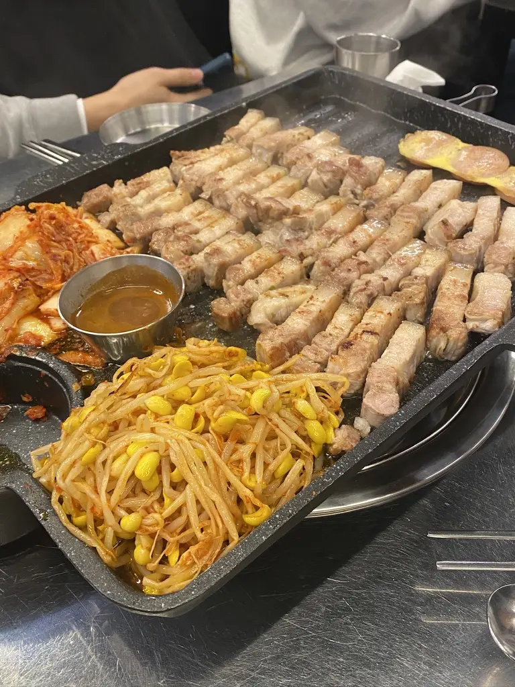

## Intro

2024.12.10 ~ 2024.12.13까지 진행된 구름톤(9oormthon) 12기에 프론트엔드 개발자로 참가했다.
이번 글에서는 첫 해커톤 참가 후기를 남기려고 한다.

이글은 개인적인 첫 해커톤 회고에 더해, 예비 구름토너 분들에게 도움이 될 수 있도록 작성하였다.

## 참여 동기

*"타 직업군과의 협업"*

IT 서비스 개발 과정에서 기획과 디자이너 분들의 결과물을 이해하고 수정을 요구하거나 의견을 더하여 아이디어를 함께 발전시키는 경험을 하고 싶었다.
이와 반대로 프로그래밍 과정 중 생길 수 있는 문제들을 기획자나 디자이너 분들이 이해할 수 있도록 설명하는 경험을 하고 싶었기 때문에 참가하게 되었다.
42seoul에서는 주로 개발 직무에 계시거나 개발을 배우신분들과 함께 협업을 했기 때문에 이번 구름톤에서는 개발에 대한 이해도가 낮은 분들과 협업을 해보고 싶었다.

*"빠르고 정확한 제품 개발 훈련"*

일반적으로 정확성과 속도는 반비례한다. 하지만 실무에서는 마감기한을 설정하고 그에 맞춰 제품을 개발해야 한다.
구름톤에서 집중적으로 몰입하여 속도는 물론 정확성까지 챙기는 훈련을 하기 위해 참가하게 되었다.

## 지원서 작성

지원서는 총 5가지 공통 항목에 + 개발 직무와 관련된 1가지 항목이 있었다.

1. 구름톤 참여 동기
2. 최근 제주도가 직면한 사회 문제
3. 위의 문제를 해결하기 위한 서비스 아이디어
4. 유연한 협업을 이끌어 나가기 위한 나만의 장점.
5. 구름톤에서의 '성장' 목표
6. 진행한 프로젝트 설명.

위의 항목 중 2, 3, 6번에 조금 더 집중해서 지원서를 작성하였다.

특히 2,3항목은 현재 제주도의 사회 문제를 정확하게 진단하는 것도 중요하지만, 그 문제를 해결하기 위한 서비스 아이디어를 제시하는 데에 더 많은 시간을 할애하였다.
지원서를 쓸 당시에 들었던 생각은 문제 정의는 다들 비슷비슷하고 새로운게 나올게 없다고 생각했기 때문에, 어떻게 하면 이 문제를 정확하게 해결할 수 있을지에 대한 아이디어를 제시하는 것이 더 중요하다고 생각했다.

그리고 6번 항목은 이전에 진행한 프로젝트를 설명하는 것이었는데, 42seoul에서 진행한 프로젝트\([webserv](https://github.com/WebWaveMaker/webserv), [ft_transcendence](https://github.com/42ForYou/ft_transcendence)등\)를 소개하려 했지만,
프로젝트를 진행한 동기와 목표를 잘 설명할 수 없을 것 같아 노트 앱 Obsidian의 간단한 플러그인을 만들었던 [obsidian-go-up](https://github.com/JinMuGo/obsidian-go-up) 프로젝트를 소개하였다.

최대한 내가 왜 이 프로젝트를 진행하였는지에 대한 문제 정의와 이를 어떻게 해결하고자 하였는지를 글에 녹여 내기위해 노력하였다.

다행히 통과하여 구름톤에 참가할 수 있었다.

## 0일차

나는 하루 전날인 12.09일에 제주도에 도착하여 구름톤 참가 준비를 하였다.

%% 18초 자기소개 글 작성이후 링크 %%

#### 자기소개 작성

구름톤 1일차에 3분 자기소개 발표를 진행하기 때문에 Notion에 자기소개 페이지를 작성해아했다.
워낙 자기소개에 서툴어서 도서관에서 "자기소개" 라는 키워드로 검색하여 나오는 책 18초 자기소개법[^self-pr-book]을 읽고, 그 책을 바탕으로 자기소개 페이지를 작성하였다.
책에 대한 리뷰는 추후에 작성할 예정이다.

페이지를 작성하고 대본을 준비할 때는 책에서 나오는

> [!note] 18초 자기소개법
>   자기소개는 자신을 소개하는 일이 아니라 내가 관여함으로써 듣는 사람이 얻을 수 있는 미래를 소개하는 일

이라는 말에 따라, 나의 경험과 이를 통해 청자가 어떤 것을 얻을 수 있는지 소개하는 방식으로 작성하였다.
그래서 내 포지션을 구름토너들의 페이스메이커로 설정하고 다른 분들이 나와 "팀이 되어 협업한다면 좋을 것이다!" 라는 메시지를 전달 하기 위해 노력하였다.

## 1일차

1일차는 해커톤에 대한 강의와 자기소개, 아이데이션 주제 발표가 있었다.

#### 해커톤 강의 - 오픈소스로 신나는 해커톤

구름톤의 진행에 앞서 어떤 마음가짐으로 해커톤에 임해야 하는지 전체적인 흐름을 알려주는 강의가 있었다.

특히 짧은 시간안에 제품을 개발해야하는 해커톤의 특성상 선택과 집중에 대한 중요성을 강조하였다.
그래서 거인의 어깨에 올라 타라. 즉, 이미 개발된 오픈소스를 활용하여 빠르게 개발하는 방법이나 린 캔버스와 같은 디자인 도구를 활용하여 빠르게 아이디어를 구체화하는 방법을 소개하였다.

MVP개발 과정에서는 다음과 같은 점을 강조하였다.

- 완벽함보다 속도 중시: 완벽한 제품 개발보다는 빠르게 아이디어를 구현하는 데 더 초점을 둔다.
- 폭넓은 관심보다는 한 곳에 집중: 적절한 특징(기능)에 집중하고 그 특징의 성공을 측정한다.
- 폭포수 대신 민첩성: 과정과 절차에 집중하지 말고, 분업과 협업으로 속도를 우선한다.
- 기능 추가 아닌 실용성: 최대한 많은 기능을 자랑하지 말고, 사용자에게 구체적인 가치를 제공한다.

확실히 짧은 기간 이어서 모든 것을 포괄하고 고려하여 개발하기 보다는. 우리가 제공하고자 하는 한 점에 집중하여 그것을 완성도 있게 제공하는 것이 중요하다는 것을 느꼈다.
핵심을 파고들어 와우 포인트를 찾아내는 것이 중요하겠다고 생각했다.

그리고 이번 해커톤에서 하지 말아야 할 것들을 알려주셨는데, 그중에 하나가 "단지 열심히 하기"였다.
무엇인가를 만들고 구현하는데만 집중하지 않고, 우리 팀이 왜 어떻게 무엇을 하는지 맥락을 잊지 않고 진행해야 한다는 것을 강조하셨다.
내가 최종적으로 이번 해커톤에서 이루고자 하는 것과 닮아 있어서 이를 가슴에 새기고 구름톤에 임하였다.

### Self PR

강의를 듣고 점심식사를 마친 뒤, 3분 자기소개 발표를 진행하였다.

발표 공포증이 있어서 미리 준비한 대본을 외워서 발표하였다. 그래도 스태프분들이 아이스브레이킹도 해주시고, 다른 분들의 발표를 들으며 긴장을 풀 수 있었다.
제주도에서 하는 해커톤이라 그런지 다들 정말 다양한 곳에서 오셨다. 만약, 서울에서 진행하였다면 이렇게 다양한 분들을 만날 수 없었을 것 같다는 생각이 들었다.
나는 긴장이 되어서 다른 분들의 발표를 집중해서 듣지는 못하였지만, 다시 한 번 이런 기회가 생긴다면 내 발표 준비도 더 열심히 하거니와 다른 분들의 발표도 더욱 집중해서 들어보고 싶다는 생각을 했다.

#### 해커톤 강의 - 해커톤에서 성장하는 방법

또 다른 해커톤 강의가 있었는데, 이 강의에서는 해커톤에서 성장하는 방법에 대해 이야기하였다.

DONE과 PERFECT에 대한 이야기를 하셨다. 우리는 대부분
**완료를 하였다고 하면 완벽하지 않았다고 생각하고, 완벽하였다고 하면 완료하지 않았다고 인식하는 경향**이 있다고 하셨다.
해커톤에서는 모두가 서로 다른 DONE의 기준을 가지고 있다. 그리고 DONE과 PERFECT는 양극단에 있는 것이 아니라고 하셨다.

그리고 DONE과 PERFECT사이에 GROWTH가 있다. 현재 DONE과 PERFECT사이에 있는 나의 상태에서 PERFECT에 가까워 지는 것이 성장이다.

"PERFECTLY DONE. 완벽에 가깝게 완료하라"라는 말이 와닿았던 발표였다.

---

그리고 1일차 끝에 아이디에션 주제 발표가 있었다. 이번 12기의 주제는 **고령화**였다.

나는 지원서를 작성할 때, 다행히 고령화와 관련된 서비스를 제시하여서 이것을 조금 더 고도화 하여 PPT를 만들었다.

그리고 1일차에는 팀원들과 중간중간 나가서 산책도하고 저녁에는 다른 구름토너분들과 흑돼지를 먹으며 즐겁게 시간을 보냈다.

|  |  |
| ---------------------- | -------------------------------- |

## 2일차

#### 2분 IDEATION

2분동안 PPT한장으로 IDEATION 발표하고, 그 후에 팀빌딩을 진행하였다.

나는 '길벗'이라는 서비스를 제안하였고. 간단히 1분 문제정의 1분 해결방안을 큰틀로 잡고 발표하였다.

발표 시간이 짧기도 했고 PPT가 1장뿐이어서 어제보다는 긴장을 덜한채로 발표할 수 있었다.
그리고 나서는 다른분들의 발표를 들으며 나는 어떤 사람과 어떤 아이디어로 팀을 이루고 싶은지 생각하였다.

### 팀빌딩

팀빌딩 시간은 시장에 온듯한 분위기였다. 아무런 시스템 없이 각자 원하는 팀원에게 의견을 묻고 팀을 결성하는 방식이었다.
나는 하고 싶은 사람들을 미리 리스트업 해놓았고, 운이 좋아서 다행히 팀을 구성하는데 큰 어려움은 없었다. 만약 구름톤에 참가하게 된다면, 팀빌딩 시간에는 자신이 어떤 사람과 어떤 아이디어로 팀을 이루고 싶은지 미리 생각해두는 것이 좋을 것 같다.
그리고 이런 시간은 어쩔 수 없이 '운'이 작용하는 것 같다. 처음에 랜덤으로 배정된 자리 기준으로 비교적 가까이에 있는 사람들과 팀을 이루게 되는 경우가 많았다.

그러니 원하는 목표나 결과가 있다면 그것을 위해 적극적으로 움직이는 것이 중요하다. 팀원이 다가오기를 바라는 것보다 직접 움직여서 팀을 이루는 것이 본인에게 더 만족스러운 결과를 가져올 것이라 생각한다.

그렇게 해서 우리 팀 "[**올망졸망똘망할망**](https://github.com/ddol-mang)"이 결성되었다. 기획자 분이 번뜩! 생각해내신 팀명이었지만 굉장히 마음에 들었다.
할망을 위해 올망졸망 모인 똘망이들. 뜻도 좋지 않은가.

### 주제 선정

팀이 결성된 이후 "제주도", "클라우드", "고령화"에 맞는 주제를 선정하기 위해 브레인스토밍 시간을 가졌다.
하지만, 주제에 맞는 서비스를 선정하는 것이 쉽지 않았다.
고령화라는 사회적 문제를 우리가 근본적으로 해결할 수는 없었고, 결국 고령화로 인해 발생하는 문제를 완화하거나 해결할 수 있는 서비스를 개발하는 방향으로 아이데이션을 진행하였다.

### 비어파티

결성된 팀원 외에 다른 팀원들과도 소통할 수 있는 비어파티 시간이 있었다.

총 세가지 타임 테이블을 기반으로 진행되었다.

1. 랜덤으로 지정된 좌석에 앉아 있는 사람들과 대화를 나누는 시간 (6시 ~ 7시 30분)
2. 직무별로 나누어진 테이블에서 자유롭게 대화를 나누는 시간 - 멘토님 참여 (7시 30분 ~ 9시)
3. 자유롭게 다른 팀원들과 대화를 나누는 시간 (9시 ~ 11시)

이번 해커톤에서 손에 꼽게 즐거웠던 시간이었다. 다른 분들과 대화를 나누는 것이 즐거웠고, 그분들의 이야기를 들으면서 다양한 생각을 할 수 있었다.
구름톤 대표님이 말씀하셨던 것처럼, 비어파티에서 만큼은 다른 분들과 네트워킹을 충분히 하고 즐기는 것이 해커톤을 더욱 즐기는 것이라고 생각한다.
나는 아직 주제가 선정되지 않아 불안한 마음에 조금 일찍 비어파티를 나왔는데, 다음에 이런 기회가 있다면 충분히 즐기며 다른 분들과 소통하고 싶다는 생각을 했다.

### 주제 결정

비어파티 이후에 팀원들과 주제를 결정하는 시간을 가졌다. 본격적으로 해커톤에 들어가기 앞서 반드시 주제를 선정하여야 했다.
굉장히 많은 이야기를 했던 것 같다. 해녀분들을 위한 서비스. 노인과 청년의 연결. 템플스테이와같은 할머니,할아버지의 집을 이용한 서비스 등등 많은 주제를 논의하였다.
하지만, 이런저런 이유들 때문에 기각되다가.

우리가 해커톤을 진행 하던 당일에 발간된 한 신문기사를 보고 주제를 선정하게 되었다.

``
  즉, 노인의 행복도에서는 자녀들은 건강하다, 자녀들이 결혼해서 화목하게 살고 있다 ...(중략)

  "삶의 만족도"에서는 "**자녀와의 관계**"가 생활 수준이나 현재의 삶보다 더 큰 영향을 미친다.
  요컨대 제주지역 노인들은 행복의 중심에 자녀를 두고 있으되 의존적이지 않고 관계 지향적이며, 일을 통해 생활의 독립과 삶의 의미를 탐색하고 자녀의 건강과 행복을 자신보다 더 소중하게 여기는 특성을 나타낸다.

라는 문장을 통해 우리는 **제주 부모와 육지 자식 간 연결성이 필요**하다는 문제인식을 하게되었고 이를 해결하기 위한 간단한 터치 몇번으로 자신의 현재 상태를 알릴 수 있는 부모-자식 간의 플랫폼을 서비스를 개발하기로 하였다.

가족과 떨어져 살아가는 사람들이 많아지고 있는 요즘, 부모님과의 소통이 어려워지고 있는 것이 현실이다.
팀원 모두가 이 문제에 대해 공감하고 흥미를 느껴 주제를 선정하게 되었다. 개인적으로 처음 주제가 결정되었을 때 감격스러웠다.
새벽 4시 까지 아이디어 회의를 하고 구체화하는 과정이 힘들었지만, 너무 즐거워서 시간 가는 줄 모르고 작업을 하였다.
잠이 많고 밤을 잘 못새는 편이라 해커톤 시작 전에 걱정하였는데. 그런걱정이 무색할 정도였다.

이후 내일을 위해 방에 들어가 잠을 자기로 하였다. 잘 못일어날까봐 다들 불안해서 팀원들과 각자의 호실을 카카오톡에 공유하고, 잠자리에 들었다.

## 3일차

주제가 선정된 이후에는 구체적인 서비스를 개발하기 위한 회의를 하며 API, DB명세를 하였고 디자이너님의 화면 설계에 따라 프론트엔드 개발 계획을 세웠다.
아직 react-query나 zustand와 같은 library에 익숙지 않아서 다른 프론트 개발자분에게 화면 구현 + 백엔드 API를 중점적으로 부탁드려 개발을 진행하였고
나는 화면 구현 + 프론트엔드 단의 배포 환경 설정을 담당하였다.

화면 구현을 할때나 frontend logic을 구현할 때, 다른 프론트엔드 개발자 분이 내가 부족한 부분을 많이 도와주셔서 빠르게 개발할 수 있었다.

그렇게 개발을 진행하던 중 우리 서비스가 **몇초 간격으로 계속 리렌더링이 발생**하는 것을 확인하였다.
새벽 4시쯤 문제를 발견하고 한 2시간동안 문제를 붙들고 있었다. 그러던 중 우리 서비스가 개발 모드로 실행되어 있는 것을 발견하였다.
나는 이 부분이 문제라고 생각하여 프로덕션 모드로 변경하길 원했지만, 크램폴린에 대한 이해도가 없어 멘토님들에게 도움을 요청하였다.
내 목적은 간단하였다. 우리 서비스는 vite로 개발되었고, 원래 개발모드로 실행되고 있던 서비스를 프로덕션 모드로 실행되게 변경하고 싶었다.
결국 멘토님들의 도움을 받아 문제를 해결할 수 있었고, 이후에는 더 이상 리렌더링이 발생하지 않았다. 문제의 전말은 이러하였다.

크램폴린으로 배포를 하는 것이 어려워 우리가 원래 하려고 했던 nginx를 이용한 정적 서버를 띄우는 방법이 아닌 다른 방법을 찾아야 했다.
그래서 백엔드 분이 멘토님께 도움을 요청하였고, 그 과정에서 개발 모드로 frontend 서버를 띄우게 된 것이다.
package.json에 `preview`가 아닌 `start`와 같은 더욱 직관적인 프로덕션 모드로 실행되는 스크립트를 추가하였다면 이런 일이 발생하지 않았을 것이다.
그래서 추상화의 중요성을 다시금 느낄 수 있던 시간이었다. 어찌저찌 문제를 해결하고 나서는 다시 다른 개발에 집중할 수 있었다.

그동안 기획자와 디자이너분들은 발표 준비를 하고 계셨다. 발표 준비 과정에 많이 참여하지 못하여서 기획자분과 디자이너분께 죄송한 마음이었다.
거의 다음날 10시가 되어서야 발표준비와 개발이 마무리되어서 11시전까지 숙소에 짐을 빼러 다녀왔다.

---

3일차에 갔던 성산일출봉과 팀원들과 함께 찍은 사진.

|  |  |
| ----------------------- | -------------------- |

## 4일차

#### 해커톤 발표

밤을 새가며 준비한 우리 서비스 "[어이, 할망](https://github.com/ddol-mang/hey-oldlady)"을 발표하였다.

우리의 발표 전략은 부모님과 떨어져 지내는 부모-자식 간의 감성을 자극하는 것이었다.
그래서 뉴스와 통계자료를 통해 문제의식을 제시하고, 이를 해결하기 위한 서비스를 소개하였다.

하지만 발표 피드백에서 우리가 내세웠던 기능과 문제 의식들이 **실제로 사용자들이 필요로 하는 것인지**에 대한 의문을 제기하셨다.
우리도 그것에 대해 많은 고민을 하였지만, 이를 충분히 설명 할 수 있는 우리의 논리를 만들지 못한 것이 아쉬웠다.

하지만 나는 우리 서비스가 사용자 경험, **고령화**라는 키워드에 집중. 그리고 이를 해결하기 위해 간편한 사용자 흐름에 집중한 것이 의미 있었다고 생각한다.
짧은 시간안에 이정도 결과물을 만들어 낸 것에 대해 우리팀이 자랑스러웠다.

## Outro

구름톤이 내세웠던 가치대로 정말 짧은 시간 동안 많은 것을 경험하고 배울 수 있었던 시간이었다.

첫 해커톤이라 미숙한 부분이 많았지만, 다행히 좋은 팀원들을 만나 함께 추억을 쌓아가며 즐거운 시간을 보낼 수 있었다.
밤을 샌다는 사실을 잊을만큼 몰입하여 개발을 하였고, 그 과정에서 많은 것을 배울 수 있었다. 우리팀이 아니었다면 완주할 수 없었을 것이다.
첫 해커톤의 단추가 너무 잘 꿰어져서 다음 해커톤에도 참가하고 싶은 마음이 들었다.

해커톤에 참가하는 많은 이유가 있겠지만 결국 **경험**인 것 같다.
팀원과 아이디어를 치열하게 고민하고 개발하는 그 과정 자체가 순수하게 즐거웠다. 이 사실 하나만으로도 충분히 가치있는 시간이었다.
그러니 만약 해커톤을 고민하고 있다면 주저없이 참가하기를 권한다.

다른 멋진 분들과의 네트워킹은 덤이다.

[^self-pr-book]: [18초 자기소개법](https://www.aladin.co.kr/shop/wproduct.aspx?ItemId=94177413)