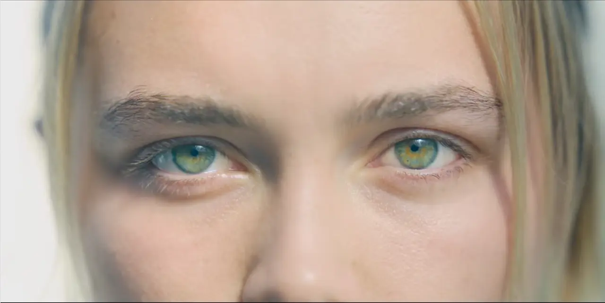
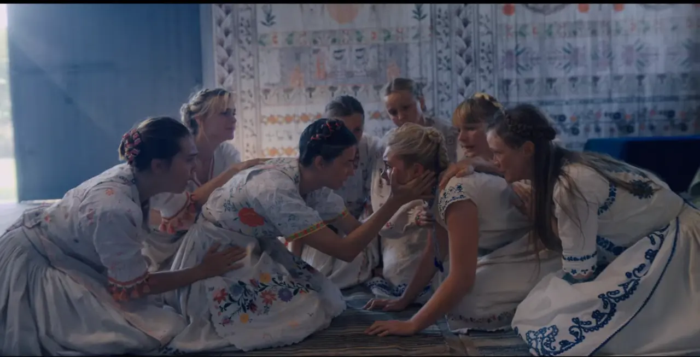

Fear comes from the unknown. We fear the unknown. If it's unfamiliar and unknown, we are scared and afraid, even if it doesn't harm us. Our reaction to this unknown is very primal. This is why the [Jump Scare](https://ko.wikipedia.org/wiki/%EC%A0%90%ED%94%84_%EC%8A%A4%EC%BC%80%EC%96%B4), the way most movies create fear, is based on this same human nature. A jump scare takes the viewer by surprise and creates a sense of dread by changing the dynamic of the shot with loud sound. The reason we find the jump scare technique scary is based on human nature. These common horror movies utilize the "fear of the unknown" to evoke fear.

**Midsoma, however, creates fear in a new way. While other horror movies start from the "unknown", this movie starts from the "base", i.e. "knowing". From the very beginning of the movie, we are shown a picture that summarizes the entire plot, and we are shown several shots that hint at Christian's future. In this way, the movie provides enough information to keep the audience informed about what is going to happen. The horror of what you, the audience, and the main character in the movie know and predict comes true. By creating a sense of foreboding and then confirming that the foreboding is not wrong, the movie creates fear. This kind of fear is definitely different from that of other horror movies. This is what the movie is trying to tell us, and it maintains this stance from beginning to end.

So what did the director want to say about this "knowing"? Let's try to figure it out by contrasting the main characters and the Horga people. Consider the two major events in the first two groups: the suicides of Danny's parents and sister, and the scene in which the people of Horga fall off a cliff after reaching the age of 72. Danny's parents and sister are near death. His sister suffers from bipolar disorder and has had nervous seizures before. And Danny has a vague premonition of his sister's death from her last email. When it does happen, Danny grieves profusely and reacts sensitively to the word "family," gagging at the mere mention of it. Danny's reaction to his family tends to be passive and avoidant.

On the other hand, Danny's reaction to the "atestupa," or death of the elderly by falling off a cliff, is the exact opposite of what the people of Horga do. The Horga say that their deaths are a great joy and part of the cycle. They also "give" death to an old man who has fallen off a cliff and is still alive. This is the product of an active, proactive approach to death, unlike Danny's, and Danny continues to observe these Horga behaviors. Danny continues to try to make sense of these events by relating them to himself, projecting the elderly Horga men who are falling to their deaths as his parents and the woman who is giving them death as his sister. In this process, Danny "stares" directly at the deaths of his family members for the first time.

> In other words, Danny confronts the tragic event that happened to him (the deaths of his family) for the first time directly as a result of the events at the Horga, which sets the stage for his healing.

There are many ways to look at this movie, but in this article, I want to talk about our attitude towards life. If we look at the people around us, including ourselves, we usually avoid, deny, and turn away from any pain in our lives. It's human nature to not want to think about it anymore and only want to see the beautiful things. The same is true for Danny and his friends in the movie. Danny is passive, avoiding the death of his family and taking medication. The same goes for his boyfriend, Christian. He's comforting Danny, but he doesn't really mean it; he's just making "gestures" of comfort to deflect the situation. This is probably how most modern people, including our protagonists, deal with pain in their lives.

The Horga community, on the other hand, does not turn away from suffering and death and try to avoid it. They don't see suffering and death as negative, and even more so, they suffer and grieve their suffering and death as if it were their own. If you've ever tried to comfort someone, you know that it's hard to truly understand their pain. It's even harder to cry with them and share their pain as if it were your own. But the Horga community actively seeks to understand others, to confront suffering and death, and to embrace it fully. It may seem a bit bizarre to us, but it's one way they cope with the pain of life.

For Danny, this attitude of the Horga community was a form of healing. It was their proactive approach to pain that allowed the Horga to heal their emotional wounds, which were not healed by medications such as tranquilizers and the comfort of a boyfriend.

Of course, there's something wrong with the way they do things. But at least they didn't try to avoid it or sweep it under the rug. They accepted pain as it came, and if someone else was hurting, they were hurting themselves. That's something we should emulate.
