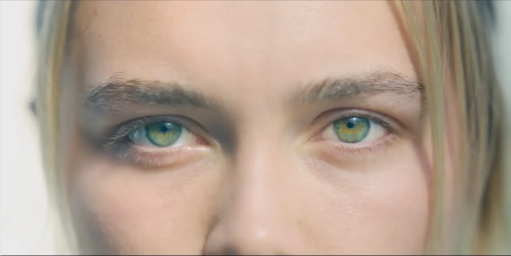

공포는 미지에서 온다. 우리는 미지를 두려워한다. 낯설고 알지 못한다면, 그것이 해를 입히지 않더라도 무서워하고 두려워한다. 이러한 알수 없는 것에 대한 우리의 반응은 굉장히 원초적이라 할 수 있다. 그래서 대개의 영화가 공포를 자아내는 방식인 [점프 스케어(Jump Scare)](https://ko.wikipedia.org/wiki/%EC%A0%90%ED%94%84_%EC%8A%A4%EC%BC%80%EC%96%B4)도 이와 같은 인간의 본성에서 기인한 것이다. 점프 스케어는 관객을 갑작스럽게 놀라게 하고 큰 사운드와 함께 쇼트를 다이내믹하게 변화시키면서 보는 이로 하여금 공포를 느끼게 한다. 우리가 점프 스케어기법이 무섭게 느낄 수 있는 이유는 전술했던 인간의 본성에 기반할 것이다. 이렇게 일반적인 공포영화들은 위와 같은 "미지로 부터오는 공포"를 이용하여 두려움을 불러일으켰다.

**하지만**, 미드소마는 새로운 방식으로 공포를 창조해냈다. 여타 공포영화들이 "미지(未知)"로부터 시작하였다면, 이 영화는 철저히 "기지(旣知)". 즉, "**앎**"으로부터 출발한다. 영화의 초반에서부터 전체 줄거리를 요약한 그림을 보여주고, 크리스티안의 미래를 암시하는 여러 숏들을 보여주는 등. 이렇듯 영화는 충분한 정보를 통해 앞으로 무슨 일이 일어날지 계속해서 관객에게 알려주고 있다. 관객과 더불어 영화에 나오는 주인공이 알고 있고 예측하고 있는 것이 실제 그대로 실현될 때의 공포. 예감을 하게 하고 그 예감이 틀리지 않았음을 확인시켜 주는 일련의 과정을 통해서 영화는 공포를 자아낸다. 이러한 공포는 확실히 다른 공포영화들의 그것과 궤를 달리한다. 이렇듯 영화는 계속해서 우리에게 알려주려 하고 있고 처음부터 끝까지 이와 같은 자세를 유지하고 있다.

그렇다면 감독은 이와 같은 "앎"에 대해 무엇을 말하고 싶었을까. 주인공들과 호르가 사람들을 대비하면서 풀어 가보자. 앞선 두 그룹의 주요한 사건인 두 장면, 대니의 부모님과 여동생이 자살을 하는 장면과 호르가 사람들 중 72세가 지난 사람들이 절벽에서 떨어지는 장면을 예로 들 수 있다. 대니는 부모님과 여동생이 죽음을 직감하고 있다. 여동생은 조울증을 앓고 있고 이전에도 신경발작을 일으킨 적이 있다. 그리고 여동생이 마지막으로 보낸 메일을 통해 대니는 어렴풋이 여동생의 죽음을 예감하고 있다. 그리고 그 일이 실제로 일어났을 때, 대니는 한 없이 슬퍼하고 주변에서 "가족"이라는 단어만 들어도 헛구역질을 하며 예민하게 반응한다. 이렇게 가족에 대한 대니의 반응은 수동적이고 회피하려는 경향을 보인다.

반면, 호르가 사람들이 노인들이 절벽에서 떨어져 죽는 "아테스투파"를 대할 때에는 대니의 반응과는 정반대의 양상을 보인다. 호르가 사람들은 그들이 죽는 것은 큰 기쁨이며 순환의 한 과정이라고 말한다. 더불어 절벽에서 떨어졌는데 아직 살아있는 노인에게 죽음을 "선사"한다. 이는 대니와 달리 죽음에 대한 능동적이고 적극적인 행동의 산물이다. 그리고 대니는 이러한 호르가 사람들의 행동을 계속해서 지켜보고있다. 대니는 계속해서 이 사건을 자신과 결부하여 이해하려고 하고 있으며, 떨어져 죽는 호르가의 노인들을 자신의 부모로 그리고 죽음을 선사하는 여자를 자신의 여동생으로 투영시켜서 이해하고 있다. 이 과정에서 대니는 처음으로 자신의 가족들의 죽음을 직접적으로 "**응시**"한다.

> 다시 말해, 대니는 본인에게 일어난 비극적인 사건(가족의 죽음)을 호르가에서의 사건으로 인해 처음으로 직접 대면하여 치유의 발판을 마련한다.

여러 가지 시선으로 이 영화를 바라볼 수 있겠지만 나는 이 글에서 **앎에 대한 우리의 자세에 대해** 말하고 싶다. 우리가 살아가고 있는 나를 포함한 주변의 사람들을 보면 대개 삶에서 어떤 고통을 겪으면 회피하고 부정하고 외면한다. 그것에 대해 더 이상생각하기 싫고 아름다운 것들만 보고 싶어 하는 인간의 본성이 기능한 것일 테다. 영화 속에서 등장하는 대니와 그의 친구들도 마찬가지이다. 대니는 가족의 죽음을 회피하고 약을 복용하는 등 수동적인 자세만을 취하고 있었다. 남자친구인 크리스티안도 마찬가지이다. 대니를 위로는 하고 있지만 진심으로 하는 것이 아닌 그 상황을 모면하려고 어떤 위로의 "제스처"만 취하고 있을 뿐이다. 이와 같이 주인공들을 비롯한 대개의 현대인들이 삶의 고통을 대하는 방식도 이와 비슷할 것이다.

반면, 호르가 공동체는 고통과 죽음을 외면하고 피하려고 하지 않는다. 그들은 고통과 죽음을 부정적인 것으로 보지 않으며, 더 나아가서는 마치 그들의 고통과 죽음을 마치 자신의 것인냥 아파하고 슬퍼한다. 누군가를 위로해 본 경험이 있다면 진심으로 그들의 고통을 이해하기란 여간 쉬운 일이 아니다. 하물며 같이 울어주고 그들의 고통을 자신의 고통인 것인 양 함께하는 것은 더더욱 어렵다. 하지만 호르가 공동체는 적극적으로 타인을 이해하고 고통과 죽음을 대면하여 그것을 온전히 받아들인다. 우리가 보기에는 다소 기괴해 보일 수 있겠지만 이건 그들이 삶의 고통에 대처하는 하나의 방법이다.

대니에게 있어서는 이와 같은 호르가 공동체의 태도가 일종의 치유로서 작용 하였다. 신경안정제와 같은 약을 복용하고 남자친구의 위로에도 낫지 않았던 마음의 상처가 호르가 사람들이 치유할 수 있었던 건 그들의 이러한 고통에 적극적인 자세가 작용한 것이 아닐까.

물론, 이러한 호르가 사람들의 방식에 문제가 있는 것은 자명하다. 하지만, 적어도 그들은 무언가를 회피하거나 덮어두려고 하지 않았다. 고통이 오면 그대로 받아들이고 누군가 아파한다면 자신도 똑같이 아파했다. 그것만큼은 우리가 본받아야 하지 않을까.