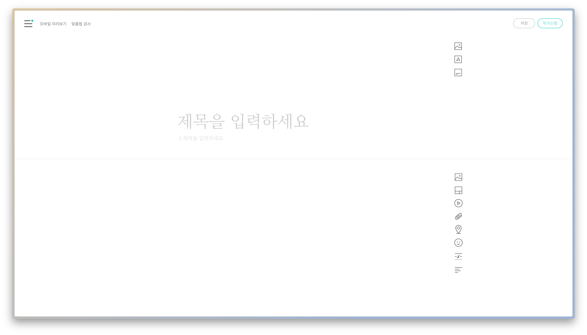
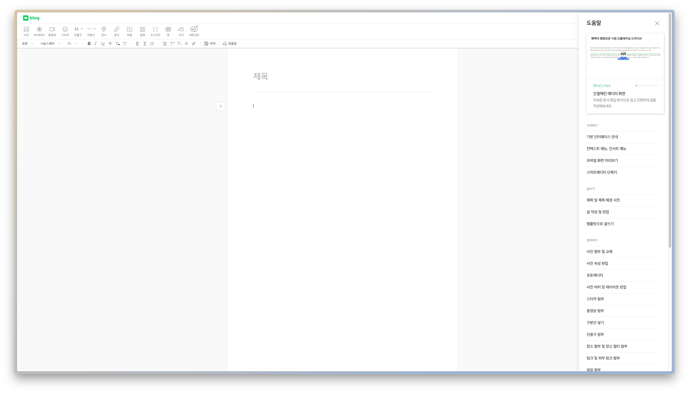
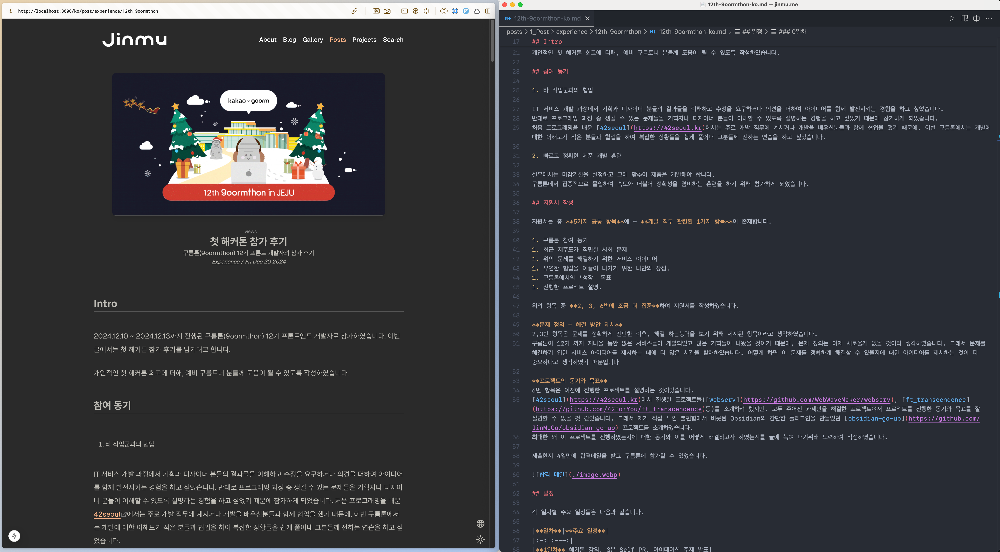

## 개요

블로그를 운영하는데에 많은 중요한 요소들이 있겠지만, 역시 가장 중요한건 얼마나 잘 읽히고, 잘 쓰느냐인 것 같아요. 글은 글을 쓰는 제게도 의미가 있지만 글을 읽는 독자와 만나면서 새로운 의미를 만들어내는 것이 글을 글답게 소비하는 방법이라는 생각이 듭니다. 하지만 잘 쓰는건 참 어려운일이죠. 그래서 저는 제가 잘 쓸 수 있는 환경을 조성하기로 하였습니다. 
오늘은 잘 쓰기 위해, 잘 쓸 수 있는 환경을 위해 노력했던 제 경험과 결과물을 소개해보겠습니다.

직접 블로그를 만들면 당연히 아래와 같은 멋진 글쓰기 전용 에디터가 없기 때문에 Vscode, Vim과 같은 소스코드 편집기를 이용해서 글을 쓰게 됩니다. 이때 사용하는 언어는 [Markdown](https://ko.wikipedia.org/wiki/%EB%A7%88%ED%81%AC%EB%8B%A4%EC%9A%B4)과 [Mdx](https://mdxjs.com/)가 있죠.

|  |  |
| ------------------------------------ | ---------------------------------- |
|                                      |                                    |
그래서 글을 쓸때에는 한쪽에는 vscode code 에디터, 한쪽에는 `dev mode`로 실행된 브라우저를 띄운 다음과 같은 환경을 구성합니다. 하지만 저는 이 환경이 어색했습니다. 코드 작성을 하는 Vscode에서 글을 쓰고 있자니 마치 목적에 맞지 않는 칼을 쓰는 느낌 이었습니다. 

물론, 코드 편집기를 가지고도 글을 잘 쓸 수 있습니다. 제가 알고 있는 개발자 분들만 하더라도 좋은글들을 뚝딱뚝딱 만들어내시죠. 장인은 도구를 가리지 않지만 저는 장인이 아니기 때문에 도구를 좀 가리기로 하였습니다.