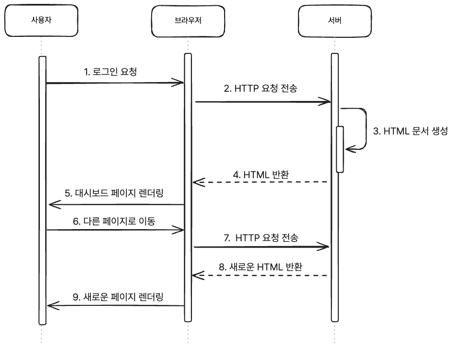
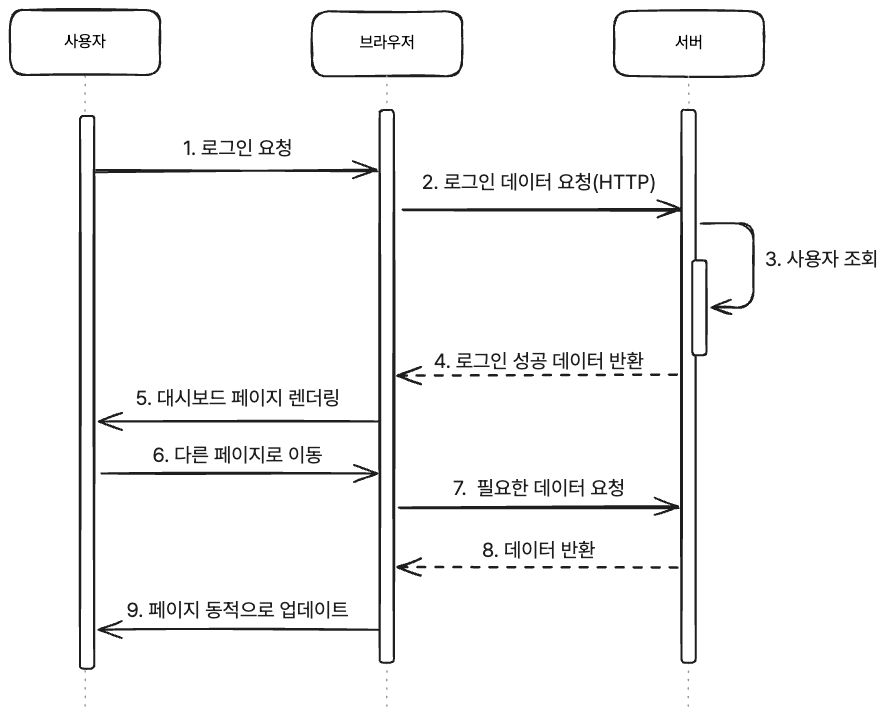

최근 웹서핑을 할 때의 기억을 한번 떠올려 볼까요? 웹사이트에서 페이지를 이동할 때 새로고침이 되는 것을 본 적이 마지막으로 언제였는지 기억나시나요?

아마도 꽤 오래전 기억일 것입니다. 오늘날 우리가 당연하게 여기는 매끄럽고 빠른 사용자 경험은 과거에는 전혀 당연하지 않았습니다.
 불과 몇 년 전만 해도, 웹 개발자들은 느린 페이지 로드와 비효율적인 UI업데이트로 인해 많은 어려움을 겪었습니다.
이 문제를 해결하기 위해 등장한 것이 <strong>SPA(Single Page Application)</strong>와 **React**입니다.

오늘은 이 두 기술이 **왜 등장했는지**, 그리고 **어떻게 웹 개발의 패러다임을 바꾸었는지** 알아보겠습니다.

## 기존 웹 서비스 동작 방식 (MPA)

MPA(Multi Page Application)는 여러개의 페이지를 가진 어플리케이션이란 뜻으로, 웹사이트의 전통적인 동작 방식입니다.
MPA는 [서버 사이드](https://en.wikipedia.org/wiki/Client%E2%80%93server_model#Server-side)의 렌더링 방식을 기반으로 작동합니다. 사용자가 페이지를 이동하거나 버튼을 클릭할 때마다, 브라우저는 서버로부터 새로운 HTML 문서를 요청하고
응답받아야 합니다. 이 과정에서 페이지의 모든 정적 리소스(CSS, JS)도 다시 로드되며 화면이 갱신됩니다.  
이 시기에는 Javascript가 그리 발달하지 않았기 때문에, 사용자 별 다른 페이지를 보여주는 등 모든 동적인 요소들은 서버 측에서 처리되었습니다. 클라이언트(브라우저)는 단순히 서버에서 제공하는 콘텐츠를 받아 화면에 렌더링하는 역할만을 수행했습니다.

만약 MPA방식으로 대시보드 페이지에 접근하기 위해 다음과 같은 페이지에 로그인을 시도한다고 가정해봅시다.

1. 사용자가 로그인 버튼을 클릭합니다.
2. 브라우저는 서버에 로그인 요청을 보냅니다.
3. 서버는 사용자를 위한 새로운 HTML을 생성하고 전달합니다.
4. 브라우저는 HTML을 렌더링하며 새 페이지를 보여줍니다.
5. 사용자가 다른 페이지로 이동하면, 다시 서버에 HTML을 요청하고 새로운 페이지를 로딩합니다.

이를 시퀀스 다이어그램으로 나타내면 다음과 같습니다.

이 과정을 거쳐야만 우리는 새로운 페이지를 볼 수 있었습니다.
초창기 웹사이트는 사용자와 인터렉션이 거의 없고 단순히 정보를 제공하는 정적인 페이지로 이루어져 있었기 때문에, 이런 방식으로도 충분했습니다.
하지만, 웹이 발전하면서 사용자 경험과 상호작용이 더욱 중요해지고, 복잡해짐에 따라 이런 방식은 점점 한계에 다다르게 되었습니다.

사용자 요청마다 서버가 전체 HTML을 포함한 정적 리소스(CSS, JS)를 생성해 응답해야 했기 때문에 불필요한 낭비가 발생하고,
결과적으로 서버에 과도한 부하를 유발하였습니다. 이는 사용자의 로딩 시간이 길어지는 원인이 되었죠.

결국, MPA 방식은 다음과 같은 문제점을 가지고 있었습니다.

- **서버 부하 증가**: 서버는 매 요청마다 새로운 HTML을 생성해야 하므로, 불필요한 리소스 낭비가 발생하고 서버 부하가 증가했습니다.
- **사용자 경험 저하**: 페이지 이동 시마다 새로고침이 발생하고 로딩 시간이 길어져, 사용자 경험이 저하되었습니다.

또한 개발자 입장에서는 페이지 간의 중복 코드나 복잡성이 증가하여 유지보수가 어려워지는 문제도 있었습니다.
그래서 더 나은 사용자 경험과 효율적인 리소스 관리를 위해 새로운 접근 방식이 필요했고, 그것이 바로 SPA였습니다. 그럼 SPA는 기존 방식과 어떤 점이 다를까요?

## SPA(Single Page Application)

SPA는 이름 그대로 하나의 페이지로 이루어진 애플리케이션입니다. [클라이언트 사이드](https://en.wikipedia.org/wiki/Client%E2%80%93server_model#Client_side) 렌더링 방식으로 작동하며,
처음 한 번 요청시 필요한 HTML,CSS,Javascript파일을 로드한 후 이후에는 페이지의 일부를 동적으로 갱신하는 방식으로 동작합니다.
MPA와 달리 SPA는 페이지 이동 시마다 서버에서 새로운 HTML을 요청하는 것이 아니라, 필요한 부분만 서버와 데이터를 주고받으며 화면을 갱신합니다.
이를 통해 빠르고 매끄러운 사용자 경험을 제공하고, 서버에 대한 부하를 최소화할 수 있습니다.

그렇다면 SPA는 어떻게 동작할까요? 위에서 예로 들었던 대시보드 페이지에 접근하는 과정을 다시 살펴보겠습니다.

1. 사용자가 로그인 버튼을 클릭합니다.
2. 브라우저는 서버에 로그인 요청을 보냅니다.
3. 서버는 사용자 조회 후 사용자 데이터만 응답으로 보냅니다.
4. 브라우저는 전송받은 데이터를 기반으로 대시보드 페이지를 업데이트합니다.
5. 사용자가 대시보드에서 다른 페이지로 이동할 때, 필요한 데이터만 서버에서 요청하고 UI를 동적으로 갱신합니다.

이를 다시 시퀀스 다이어그램으로 나타내면 다음과 같습니다.

이처럼 SPA는 MPA와 달리 서버에서 전체 HTML을 다시 렌더링하는 것이 아니라 필요한 데이터만 서버에서 받아와 클라이언트에서 UI를 업데이트합니다.
그리고 그 이후에도 필요한 데이터만 서버에서 요청 받아 화면을 갱신하기 때문에, 사용자 경험과 서버 부하를 모두 개선할 수 있었습니다.
이는 AJAX의 등장이나 브라우저의 성능이 향상되면서 가능할 수 있었떤 기술이었습니다.

``
  Ajax는 클라이언트 측에서 비동기적으로 서버와 데이터를 주고받는 웹 개발 기술들의 집합으로, 페이지 새로고침 없이 콘텐츠를 동적으로 업데이트할 수 있게 합니다.
  기존 기술(HTML, CSS, JavaScript, XMLHttpRequest)을 조합해 데이터와 화면 표시를 분리하며, 오늘날에는 주로 JSON을 사용합니다.
  **Ajax는 새로운 기술이 아니라, 기존 기술을 새로운 방식으로 활용하는 프로그래밍 개념입니다.**

### SPA의 장점

- **빠른 페이지 로딩**: 초기 페이지 로드 시 필요한 리소스를 한 번만 로드하고, 이후에는 필요한 데이터만 서버에서 받아옵니다.
- **부드럽고 빠른 화면 전환**: 페이지 이동 시에도 새로고침 없이 클라이언트에서 페이지를 동적으로 업데이트합니다.
- **서버 부하 감소**: 서버는 전체 HTML을 다시 렌더링하는 것이 아니라 필요한 데이터만 반환하여 클라이언트에서 UI를 업데이트합니다.

이런 장점들로 SPA는 MPA의 문제점을 다음과 같이 해결합니다.

1. 서버 부하 감소 문제
ㅐ

SPA는 필요한 데이터만 서버에서 요청하고 응답받기 때문에, 서버의 부하를 줄일 수 있습니다.
이제 서버는 전체 HTML 렌더링 대신 필요한 데이터를 반환하는 역할만 수행하므로, 더 간단하고 빠른 응답이 가능합니다.

2. 사용자 경험 향상 문제

페이지 이동 시에도 새로고침 없이 클라이언트에서 페이지를 동적으로 업데이트합니다. 부드럽고 빠른 화면 전환을 경험하게 되며, 상호작용의 연속성이 유지됩니다.
이로 인해 UX가 향상되고, 응답성이 크게 개선됩니다.

하지만 SPA도 은탄환은 아닙니다. 모든 기술에는 항상 트레이드오프가 존재하듯이, SPA도 그렇습니다.

### SPA의 단점

- **SEO(검색 엔진 최적화) 문제**: SPA는 초기 페이지 로드 시에 필요한 리소스를 한 번만 로드하고, 이후에는 필요한 데이터만 서버에서 받아오기 때문에, 검색 엔진이 페이지를 크롤링하기 어렵습니다.
- **초기 로딩 속도**: SPA는 초기 페이지 로드 시 필요한 리소스를 한 번에 로드하기 때문에, 초기 로딩 속도가 느릴 수 있습니다.
- **DOM 조작 관련 문제**: SPA는 클라이언트에서 페이지를 동적으로 업데이트하기 때문에, DOM 조작이 복잡해질 수 있습니다.
또한 DOM 변경시 리플로우나 리페인트를 반복해서 수행하기 때문에 성능 문제가 발생할 수 있습니다.

우리는 이번 글에서 React에 대해 다룰 것이기 때문에, DOM조작 관련 문제에 대해 더 자세히 알아보겠습니다.

### DOM조작의 복잡성과 비효율성
