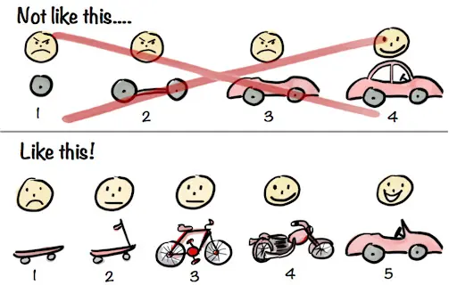

## Intro

I participated as a front-end developer in the 12th edition of 9oormthon, which ran from December 10, 2024 to December 13, 2024. In this post, I'd like to write about my first hackathon experience.

In addition to my personal first hackathon recollection, I hope this post will be helpful for prospective goormoners.

## Motivation to participate

1. collaboration with other professions

In the process of IT service development, I wanted to experience understanding the output of planners and designers and develop ideas together by requesting modifications or adding opinions.
Conversely, I wanted to participate because I wanted to have the experience of explaining the problems that may arise during the programming process so that the planners and designers could understand.
At [42seoul](https://42seoul.kr), where I first learned programming, I mainly collaborated with people who worked in development or learned development, so at this Goormathon, I wanted to collaborate with people who had less understanding of development and practice solving complex situations in an easy way and conveying them to them.

2. Fast and accurate product development training

In the real world, you have to set deadlines and develop products accordingly.
I participated in Goormathon to practice both speed and accuracy through intensive immersion.

## Write an application

The application has a total of **5 common items** + **1 item specific to the development job**.

1. Motivation for participating in Goormathon
2. social issues facing Jeju Island recently
3. service ideas to solve the above problems
4. Your own strengths to lead flexible collaboration.
5. Goal for 'growth' in Goormathon
6. Description of projects you have worked on.

I wrote my application with **a little more focus on 2, 3, and 6** of the above items.

\*\*Problem Definition + Solution Proposal
I thought that items 2 and 3 were presented to see the ability to accurately diagnose the problem and then solve it.
Since many services have been developed and many plans have been made in the past 12 years of Goormtone, I thought that the problem definition would not be new anymore. Therefore, I spent more time on presenting service ideas to solve the problem. I thought it was more important to present ideas on how to solve this problem correctly.

\*\*Motivation and goals of the project
Item 6 was to describe the projects they have worked on before.
I was going to introduce some of the projects I worked on at [42seoul](https://42seoul.kr) ([webserv](https://github.com/WebWaveMaker/webserv), [ft_transcendence](https://github.com/42ForYou/ft_transcendence), etc.), but since they all solved a given problem, I didn't think I could explain my motivation and goals for the project very well. Therefore, I introduced the [obsidian-go-up](https://github.com/JinMuGo/obsidian-go-up) project, which was a simple plugin for Obsidian that was born out of my own frustrations.
I've tried to convey as much as I can in this post about my motivation for the project and how I tried to solve it.

Within 4 days of submission, I received an acceptance email and was able to participate in the goormathon.

## Schedule

The main schedule for each day is as follows

| **Day 1** |                        **Main Schedule**                         |
| :-------: | :--------------------------------------------------------------: |
| **Day 1** | Hackathon Lecture, 3-minute Self PR, Ideation Topic Presentation |
| **Day 2** |           2-minute IDEATION, Team Building, Beer Party           |
| **Day 3** |                          Hackathon run                           |
| **Day 4** |     Hackathon Presentation, Results Announcement and Awards      |

### Day 0

I arrived in Jeju Island on the afternoon of December 09th, the day before, and prepared to participate.

### Write a self-introduction

I had to create a bio page on Notion because I had to perform a 3-minute Self PR on the first day of Goormathon.
I'm not very good at introducing myself, so I was most afraid of the Self PR on the first day. I had to give presentations since I was in school, and my ears and face would turn red just getting up from my seat, so I often avoided presentations. However, I realized that I couldn't even convince others if I avoided it just because I couldn't give a presentation. So I wanted to get better this time, so I searched for the keyword "self-presentation" in the library and read the book 18-second self-presentation method [^self-pr-book], and wrote a self-presentation page based on the book and prepared for the presentation.

At the beginning of the book, the author says

> [!note] The 18-second elevator pitch.
>
> > A bio is not about introducing yourself, it's about introducing the future the listener can gain from your involvement.

Following this advice, I've written my bio in such a way that it's about what the listener can gain from my experience. In other words, I made my bio about the listener, not me, so I positioned myself as the pacer of the cloud talkers and tried to convey a metaphorical message to others, "It would be great to team up with me and collaborate!"

Below is the bio page I wrote.

After I finished writing both the bio page and the script, I went to sleep.

## Day 1

Day 1 consisted of hackathon lectures and presentations on the topics of Self PR and Foundations.

### Hackathon Lecture

_Exciting hackathon with open source_.

Before the Goormathon. We had a lecture that gave us an overview of how to approach a hackathon with the right mindset.

In particular, the importance of selection and focus was emphasized due to the nature of the hackathon, which is to develop a product in a short time.
Therefore, we introduced how to develop quickly by utilizing already developed open source or how to quickly materialize ideas by utilizing design tools such as Lean Canvas.

In the MVP development process, we emphasized the following points.

- Prioritize speed over perfection: Focus on implementing ideas quickly rather than developing a perfect product.
- Focus on one thing rather than a broad interest: Focus on the right features (functionality) and measure the success of those features.
- Agility instead of waterfall: Don't focus on process and procedure, prioritize speed with division of labor and collaboration.
- Practicality, not more features: Don't boast as many features as possible, but provide specific value to users.

Obviously, we had to develop a small service in a short period of time, so we realized that it was important to focus on one thing we wanted to offer and deliver it with perfection, rather than trying to develop everything.

Also, the hackathon taught us some things not to do, and one of them was to **just work hard**.
He emphasized that we shouldn't just focus on building and implementing something, and not forget the context of **why and how our team is doing what we are doing**. This is not just for hackathons.
I took this to heart and went into Goormathon with it in mind because it's similar to what I ultimately wanted to accomplish in this hackathon.

### Self PR

After the lecture and lunch, we had a 3-minute self-pitch.

I memorized a script that I had prepared the day before and presented it. I was able to break the ice and relax while listening to other people's presentations.
Since it was a hackathon in Jeju Island, everyone was from so many different places, and I realized that I wouldn't have been able to meet such a diverse group of people if it was held in Seoul.
I was too nervous to listen to other people's presentations, but if I had this opportunity again, I would work harder to prepare my presentation and listen to other people's presentations more intently.

Below is my full bio.

> [!quote]+ bio
>
> > Hello, I'm Jinmoo Go, a front-end developer who wants to be a pacemaker for goormonster.
>
> This Goormathon is a special opportunity for me. It is because I can team up with experts in various fields and learn together from planning to deployment. Especially, I think it will be really valuable to have the experience of understanding and communicating with planners and designers for the first time. I hope to create a meaningful time to achieve a common goal through this process.
>
> That's why I'm going to be a pacemaker in this Goormathon. A pacemaker doesn't just run ahead of the team, but also understands the status and needs of the team members and acts accordingly. I thought that the ability of a pacemaker to understand the other person and decide my behavior accordingly is also functional in Goormathon.
>
> My name is written as 'Moo to touch' on 'Jin to calm down', which means 'true Jin' is a spinner, and 'Moo to touch' is written as 'Handoja' on 'nothing', which means 'touching something that is not there', which means to touch the heart. Since I became a programmer, I thought that I would spend my life creating something that touches people's hearts, and I would like to create something wonderful with you in this Goormathon. If you want to build a great team, feel free to reach out. I hope we can create a great experience together. Thank you.

### Hackathon Lecture - How to Grow from a Hackathon

After the introductions, there were other hackathon lectures, which talked about how to grow in a hackathon. One that stood out in my mind was the talk about `DONE` and `PERFECT`.

He said that most of us tend to perceive DONE as not being perfect, and PERFECT as not being done.
In a hackathon, everyone has a different definition of DONE, so DONE and PERFECT are not polar opposites.

And in between DONE and PERFECT is GROWTH. Moving from your current state of being between DONE and PERFECT to getting closer to PERFECT is called growth.

Hence, "PERFECTLY DONE." Every moment of the hackathon. You said to aim to get it done as close to perfect as possible.

This lecture is said to be based on Chiksent Mihai's \<Immersion\>[^1], if you're interested, you might want to check it out.

### Presentation on the topic of foundation

At the end of Day 1, we had the presentation of the foundation topic.
The topic for this 12th edition was **Aging**.

When I wrote my application, I presented a service related to aging, so I made a PPT that was a little more advanced.

### Wrapping up Day 1

On Day 1, I went out for a walk with my teammates in the middle of the day and had a good time eating black pork with other Goormoners in the evening. You don't get to go outside that much during Goormathon, so I recommend that you move around a lot from day 1. Sometimes it's hard to realize that you're in Jeju Island.

|  |  |
| ---------------------- | -------------------------------- |

## Day 2

On the second day, the participants had the opportunity to think of their own ideas on the previous day's foundation topic, 'Aging', and present them in the
2-minute ideation time, team building, and a beer party.

### 2-minute IDEATION

You have 2 minutes to present your idea on one page of PPT.
I proposed a service called 'Gilbot'. I presented **1-minute problem definition** **1-minute solution** with a big framework.

Since the presentation time was short and I only had one PPT, I was able to present with less tension than yesterday.
Afterward, I listened to other people's presentations and thought about what kind of people and ideas I would like to team up with.

### Team building

The team building time was like a marketplace. There was no system, we just asked each other who we wanted to team up with and formed a team.

I had already made a list of people I wanted to work with while listening to the foundation, and luckily I didn't have much trouble organizing my team. If you're going to participate in a goormathon, I would recommend that you think about who you want to team up with and what ideas you want to bring to the table during the team building time.
There is a certain amount of 'luck' that comes into play during this time, and we were often teamed up with people who were relatively close to each other based on our initially randomized seat assignments.

So if you have a goal or outcome you want, it's important to be proactive about it. You'll be more satisfied with the outcome if you make the move and team up with someone rather than hoping they'll come to you.

That's how our team, "[**Olmangolmangolmangolmang**](https://github.com/ddol-mang)" was formed. Our organizer came up with the team name out of the blue, and we all liked it so much that we decided to stick with it.

A bunch of old ladies gathered for old ladies, doesn't that sound good?

After the team was formed, we had a brainstorming session to select topics that fit the theme of 'Jeju Island', 'Cloud', and 'Aging'. However, it was not easy to select services that fit the theme.
We couldn't fundamentally solve the social problem of aging, so we decided to develop a service that could alleviate or solve problems caused by aging.

However, we ended up at the beer party at 6pm with no good ideas.

### Beer Party

In addition to the formed team, we had a beer party to connect with other team members and mentors.

Beer parties were based on three different timetables.

1. a time to chat with people sitting in randomly assigned seats (6:00-7:30)
2. free-flowing conversations at tables divided by job function - with mentor participation (7:30-9:00)
3. free time to chat with other team members (9-11)

This was one of my favorite parts of the hackathon. It was fun to talk to other people who came to the Goormathon, and I was able to think about various things while listening to their stories.
I think Goormathoners who participate in Goormathon should spend at least as much time talking and networking with other people at the beer party as they do at the hackathon to get 200% out of it.

### Decide on a topic

After the beer party, we got back together and decided on a topic with our teammates. We had to choose a topic before we started the hackathon tomorrow.
I think we talked about a lot of things. Services for seafarers. Connecting the elderly and the young. A service using grandma and grandpa's house like a temple stay, and many other topics were discussed but dismissed for various reasons.
We chose the topic based on [a newspaper article](https://www.jejunews.com/news/articleView.html?idxno=2215293) that was published on the day of the hackathon that one of the team members found.

> [!quote]
>
> > In other words, when it comes to the happiness of the elderly, their children are healthy, their children are married and living in harmony, and they continue to be active as long as their bodies allow.
>
> ... (emphasis added)
>
> > "Relationship with children" is more important than living standard or current life when it comes to life satisfaction.
> > In short, older adults in Jeju Island have their children at the center of their happiness, but they are relationship-oriented rather than dependent, explore independence and meaning in life through work, and value their children's health and happiness more than their own.

The above article made us realize that there is a need for a connection between Jeju parents and their mainland children, and to solve this problem, we decided to develop a platform between parents and children that allows them to communicate their current status through simple interactions.

The topic was chosen because everyone on the team felt empathy and excitement for this problem. Personally, I was overwhelmed when the topic was first decided.
The process of brainstorming and refining the idea was hard, but we were having so much fun that we stayed up until 4am.
I was worried before the hackathon started because I'm a light sleeper and a night owl, but I was so engrossed that it didn't matter.

Afterward, we decided to go to our rooms to sleep for the hackathon tomorrow. We were all worried about oversleeping, so we shared our rooms on KakaoTalk with our teammates and went to bed.

## Day 3

After the topic was selected, we had a meeting to develop a specific service, and we made API, DB specification, and front-end development plan according to the designer's screen design.

Since I was not yet familiar with libraries such as react-query and zustand, I asked another front-end developer to focus on the screen implementation + back-end API, and I was in charge of the screen implementation + deployment environment of the front-end stage.

During the development process, I noticed that our deployed service kept re-rendering every few seconds. I found the problem around 4am, and after about 2 hours of troubleshooting, I realized that our service was running in development mode.
I realized that this was the problem and wanted to change it to production mode, but I didn't understand the crampoline (deployment environment), so I asked my mentors for help.
My intentions were simple. The service was developed with VITE and I wanted to change the service, which was originally running in development mode, to run in production mode. Here's how it happened

The backend developer was not familiar with crampoline and had difficulty deploying it, so we had to find a way to do something other than spinning up a static server with nginx, which is what we originally wanted to do.
So the backend guy asked his mentor for help, and that's how we ended up spinning up the frontend code in development mode (e.g. `pnpm dev`) rather than the logic of serving static files with nginx after the original static build.
VITE has an `images` command that serves static files into production. It occurred to me that this wouldn't have happened if I had added a more intuitive production-ready script to the `package.json` `script`, such as `start` instead of `images`. It was a good reminder of the importance of abstraction.

In the meantime, the planners and designers were preparing for the presentation, and I apologized to them for not being able to participate much in the process.
By 10 o'clock the next day, the presentation preparation and development were finalized.

Seongsan Sunrise Peak, which we visited during the hackathon.
And a photo with the team members.

|  |  |
| ------------------------------------- | -------------------- |

## Day 4

Day 4 was the hackathon presentation and awards.

### Hackathon presentation

We presented our service "[Hey, old lady](https://github.com/ddol-mang/hey-oldlady)", which we had been working on all night.

Our presentation strategy was to appeal to the emotions of parents and children living apart from their parents.
We presented the problem through news and statistics, and introduced a service to solve it.

However, in the feedback from the presentation, you raised the question of whether the features and problems we presented were **actually needed by users**.
We thought a lot about this, but we were disappointed that we didn't create a logic that could explain it well enough.
However, we really enjoyed the fact that our service focused on user experience and **aging** and focused on a simple user flow to solve it.

## Outro

It was a great experience and a lot of learning in a very short time, true to the values that Goormtone has been promoting.

It was my first hackathon, so there were a lot of unknowns, but I was able to meet great teammates and have a great time building memories together.
We worked so hard that we forgot to sleep at night, and we learned a lot in the process.
Personally, the first hackathon buttoned me up so well that I'm eager to participate in other hackathons.

There are many reasons to participate in a hackathon, but I think it's all about the experience. The process of intensely thinking and developing ideas with my teammates at the goormathon was purely enjoyable, and that alone made it worthwhile for me.

So if you're on the fence about participating in a hackathon, I highly recommend it.
The networking with other cool people is a bonus.

[^self-pr-book]: [18 Second Self-Pitch](https://www.aladin.co.kr/shop/wproduct.aspx?ItemId=94177413)

[^1]: [Immersion](https://www.aladin.co.kr/shop/wproduct.aspx?ItemId=503603)
