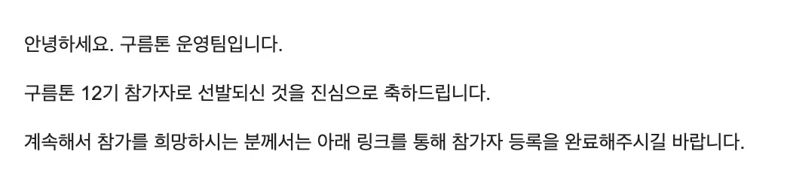
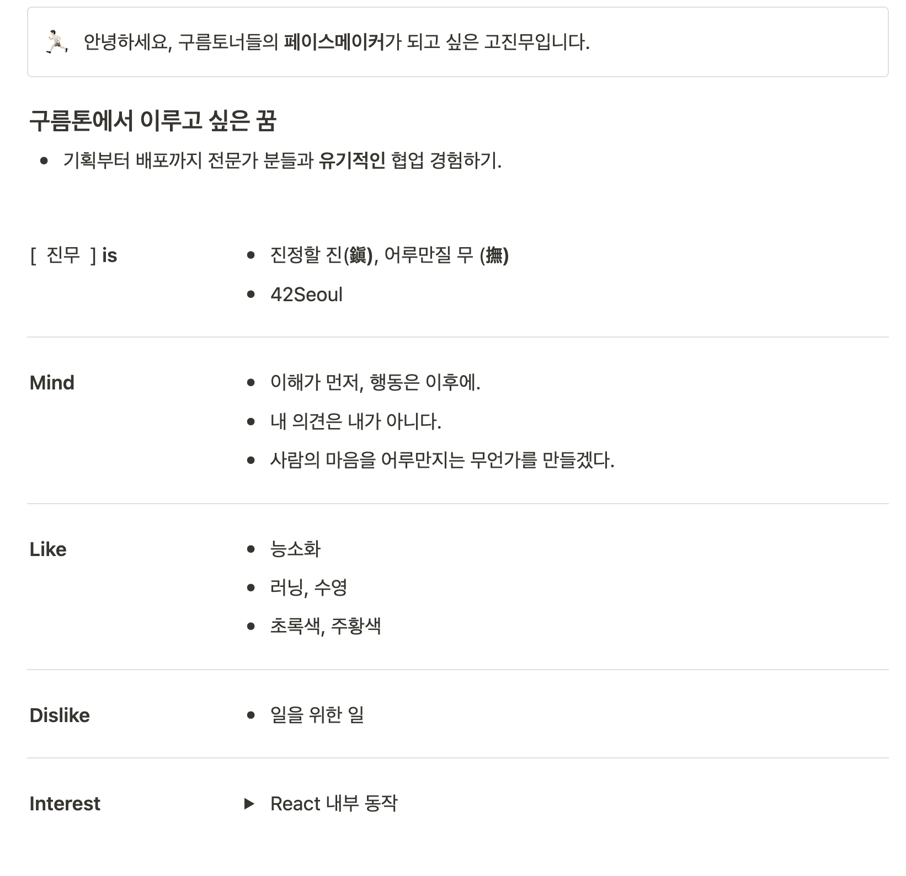
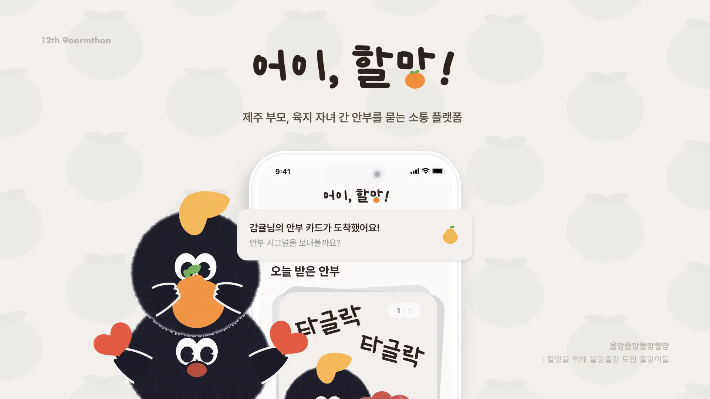

## Intro

2024.12.10 ~ 2024.12.13까지 진행된 구름톤(9oormthon) 12기 프론트엔드 개발자로 참가하였습니다.
개인적인 첫 해커톤 회고에 더해, 예비 구름토너 분들께 도움이 될 수 있도록 작성하였습니다.

## 참여 동기

1. 타 직업군과의 협업

IT 서비스 개발 과정에서 기획과 디자이너 분들의 결과물을 이해하고 수정을 요구하거나 의견을 더하여 아이디어를 함께 발전시키는 경험을 하고 싶었습니다.
반대로 프로그래밍 과정 중 생길 수 있는 문제들을 기획자나 디자이너 분들이 이해할 수 있도록 설명하는 경험을 하고 싶었기 때문에 참가하게 되었습니다.
처음 프로그래밍을 배운 [42seoul](https://42seoul.kr)에서는 주로 개발 직무에 계시거나 개발을 배우신분들과 함께 협업을 했기 때문에, 이번 구름톤에서는 개발에 대한 이해도가 적은 분들과 협업을 하여 복잡한 상황들을 쉽게 풀어내 그분들께 전하는 연습을 하고 싶었습니다.

2. 빠르고 정확한 제품 개발 훈련

실무에서는 마감기한을 설정하고 그에 맞추어 제품을 개발해야 합니다.
구름톤에서 집중적으로 몰입하여 속도와 더불어 정확성을 겸비하는 훈련을 하기 위해 참가하게 되었습니다.

## 지원서 작성

지원서는 총 **5가지 공통 항목**에 + **개발 직무 관련된 1가지 항목**이 존재합니다.

1. 구름톤 참여 동기
2. 최근 제주도가 직면한 사회 문제
3. 위의 문제를 해결하기 위한 서비스 아이디어
4. 유연한 협업을 이끌어 나가기 위한 나만의 장점.
5. 구름톤에서의 '성장' 목표
6. 진행한 프로젝트 설명.

위의 항목 중 **2, 3, 6번에 조금 더 집중**하여 지원서를 작성하였습니다.

**문제 정의 + 해결 방안 제시**
2,3번 항목은 문제를 정확하게 진단한 이후, 해결 하는능력을 보기 위해 제시된 항목이라고 생각하였습니다.
구름톤이 12기 까지 지나올 동안 많은 서비스들이 개발되었고 많은 기획들이 나왔을 것이기 때문에, 문제 정의는 이제 새로울게 없을 것이라 생각하였습니다. 그래서 문제를 해결하기 위한 서비스 아이디어를 제시하는 데에 더 많은 시간을 할애하였습니다. 어떻게 하면 이 문제를 정확하게 해결할 수 있을지에 대한 아이디어를 제시하는 것이 더 중요하다고 생각하였기 때문입니다

**프로젝트의 동기와 목표**
6번 항목은 이전에 진행한 프로젝트를 설명하는 것이었습니다.
[42seoul](https://42seoul.kr)에서 진행한 프로젝트들([webserv](https://github.com/WebWaveMaker/webserv), [ft_transcendence](https://github.com/42ForYou/ft_transcendence)등)를 소개하려 했지만, 모두 주어진 과제만을 해결한 프로젝트여서 프로젝트를 진행한 동기와 목표를 잘 설명할 수 없을 것 같았습니다. 그래서 제가 직접 느낀 불편함에서 비롯된 Obsidian의 간단한 플러그인을 만들었던 [obsidian-go-up](https://github.com/JinMuGo/obsidian-go-up) 프로젝트를 소개하였습니다.
최대한 왜 이 프로젝트를 진행하였는지에 대한 동기와 이를 어떻게 해결하고자 하였는지를 글에 녹여 내기위해 노력하여 작성하였습니다.

제출한지 4일만에 합격메일을 받고 구름톤에 참가할 수 있었습니다.

## 일정

각 일차별 주요 일정들은 다음과 같습니다.

| **일차**  |                 **주요 일정**                  |
| :-------: | :--------------------------------------------: |
| **1일차** | 해커톤 강의, 3분 Self PR, 아이데이션 주제 발표 |
| **2일차** |        2분 IDEATION, 팀 빌딩, 비어파티         |
| **3일차** |                  해커톤 진행                   |
| **4일차** |         해커톤 발표, 결과 발표 및 시상         |

### 0일차

저는 하루 전날인 12.09일 오후 제주도에 도착하여 참가 준비를 하였습니다.

### 자기소개 작성

구름톤 1일차에 3분 Self PR을 진행하기 때문에 Notion에 자기소개 페이지를 작성해야했습니다.
저는 워낙 자기소개에 서툴어서 첫날 진행되는 Self PR이 제일 두려웠습니다. 학창시절부터 발표를 해야해서 자리에서 일어나기만 해도 귀와 얼굴이 빨개졌거든요. 그래서 종종 발표를 피하곤 했습니다. 하지만 발표를 못한다고 해서 피하기만 해선 남을 설득하는 것조차도 못하겠더군요. 그래서 이번 기회에 조금이라도 나아지고자 도서관에서 "자기소개" 라는 키워드로 검색하여 나오는 책 18초 자기소개법[^self-pr-book]을 읽고, 그 책을 바탕으로 자기소개 페이지를 작성하고 발표 준비를 하였습니다.

책의 초반부에 작가는 이렇게 말합니다.

> [!note] 18초 자기소개법
> 자기소개는 자신을 소개하는 일이 아니라 내가 관여함으로써 듣는 사람이 얻을 수 있는 미래를 소개하는 일

이 말을 따라서, 저의 경험을 통해 청자가 어떤 것을 얻을 수 있는지 소개하는 방식으로 작성하였습니다. 다시말해, 자기소개를 제 중심이 아닌 듣는이를 중심으로 구성하였습니다. 그래서 제 포지션을 **구름토너들의 페이스메이커로 설정**하고 다른 분들께 "저와 팀이 되어 협업한다면 좋을 것이다!" 라는 은유적인 메시지를 전달 하기 위해 노력하였습니다.

아래는 제가 작성한 자기소개페이지입니다.

이후 자기소개 페이지와 대본을 모두 작성한 이후에는 잠을 자러 갔습니다.

## 1일차

1일차는 해커톤 강의와 Self PR, 아이데이션 주제 발표가 있었습니다.

### 해커톤 강의

_오픈소스로 신나는 해커톤_

구름톤의 진행에 앞서. 어떤 마음가짐으로 해커톤에 임해야 하는지 전체적인 흐름을 알려주는 강의가 있었습니다.

특히 짧은 시간안에 제품을 개발해야하는 해커톤의 특성상 **선택과 집중에 대한 중요성**을 강조하였습니다.
그래서 이미 개발된 오픈소스를 활용하여 빠르게 개발하는 방법이나 린 캔버스와 같은 디자인 도구를 활용하여 빠르게 아이디어를 구체화하는 방법을 소개하였습니다.

MVP개발 과정에서는 다음과 같은 점을 강조하였습니다.

- 완벽함보다 속도 중시: 완벽한 제품 개발보다는 빠르게 아이디어를 구현하는 데 더 초점을 둔다.
- 폭넓은 관심보다는 한 곳에 집중: 적절한 특징(기능)에 집중하고 그 특징의 성공을 측정한다.
- 폭포수 대신 민첩성: 과정과 절차에 집중하지 말고, 분업과 협업으로 속도를 우선한다.
- 기능 추가 아닌 실용성: 최대한 많은 기능을 자랑하지 말고, 사용자에게 구체적인 가치를 제공한다.

확실히 짧은 기간 안에 작은 서비스 하나를 개발하여야 하다보니. 모든 것을 고려하여 개발하기 보다는 우리가 제공하고자 하는 한 점에 집중하여 그것을 완성도 있게 제공하는 것이 중요하다는 것을 느꼈습니다.

그리고 이번 해커톤에서 하지 말아야 할 것들을 알려주셨습니다. 그중 하나가 **단지 열심히 하기**였습니다.
무엇인가를 만들고 구현하는데만 집중하지 않고, **우리 팀이 왜 어떻게 무엇을 하는지** 맥락을 잊지 않고 진행해야 한다는 것을 강조하셨습니다. 이는 비단 해커톤 뿐만이 아니겠지요.
제가 최종적으로 이번 해커톤에서 이루고자 하는 것과 닮아 있어서 이를 가슴에 새기고 구름톤에 임하였습니다.

### Self PR

강의를 듣고 점심식사를 마친 뒤, 3분 자기소개 발표를 진행하였습니다.

저는 전 날 미리 준비한 대본을 외워서 발표하였습니다. 아이스브레이킹도 하고, 다른 분들의 발표를 들으며 긴장을 풀 수 있었습니다.
제주도에서 하는 해커톤이라 그런지 다들 정말 다양한 곳에서 오셨더군요. 만약, 서울에서 진행하였다면 이렇게 다양한 분들을 만날 수 없었을 것 같다는 생각이 들었습니다.
긴장이 되어서 다른 분들의 발표를 집중해서 듣지는 못하였지만, 다시 한 번 이런 기회가 생긴다면 내 발표 준비도 더 열심히 하거니와 다른 분들의 발표도 더욱 집중해서 들어보고 싶다는 생각을 했습니다.

아래는 제 자기소개 전문입니다.

> [!quote]+ 자기소개
> 안녕하세요, 구름토너들의 페이스메이커가 되고 싶은 프론트엔드 개발자 고진무입니다.
>
> 제게 이번 구름톤은 특별한 기회입니다. 다양한 분야의 전문가들과 팀을 이루어 기획부터 배포까지 함께 협업하며 배울 수 있기 때문입니다. 특히 기획자와 디자이너분들과 처음 협업하며 서로의 말을 이해하고 소통하는 경험이 정말 소중할 것 같습니다. 이런 과정을 통해 공동의 목표를 이루는 뜻깊은 시간을 만들고 싶습니다.
>
> 그래서 저는 이번 구름톤에서 페이스메이커가 되려 합니다. 페이스메이커는 단순히 앞서 달리는 것이 아니라, 팀원들의 상태와 요구를 파악하고 그에 맞춰 행동하는 역할을 하는데요. 상대방을 이해하고 그에 맞추어 내 행동을 결정하는 페이스 메이커의 능력이 구름톤에서도 기능한다고 생각하였습니다.
>
> 제 이름은 '진정할 진'에 '어루만질 무'를 씁니다. '진정한 진'은 돌림자이고 어루만질 무는 '없을 무'에 '손수 자'를 써서 '없는 것을 만지는 것'이라는 뜻을 담고 있으며, 이를 해석하면 마음을 어루만진다는 의미가 됩니다. 저는 프로그래머가 된 이후, 사람의 마음을 어루만지는 무언가를 만들며 살아가겠다고 생각했습니다. 이번 구름톤에서도 여러분과 멋진 결과물을 만들어가고 싶습니다. 멋진 팀을 이루고 싶다면 언제든 편하게 말을 걸어주세요. 여러분과 함께 좋은 경험을 만들어 나가길 바랍니다. 감사합니다.

### 해커톤 강의 - 해커톤에서 성장하는 방법

자기소개 이후 다른 해커톤 강의가 있었는데, 이 강의에서는 해커톤에서 성장하는 방법에 대해 이야기하였습니다. 그중 기억에 남는 것은 `DONE`과 `PERFECT`에 대한 이야기 였습니다.

우리는 대부분 **완료(DONE)를 하였다고 하면 완벽(PERFECT)하지 않았다고 생각하고, 완벽하였다고 하면 완료하지 않았다고 인식하는 경향**이 있다고 합니다.
해커톤에서는 모두가 서로 다른 DONE의 기준을 가지고 있습니다. 그렇기 때문에, DONE과 PERFECT는 양극단에 있는 것이 아닙니다.

그리고 DONE과 PERFECT사이에 GROWTH가 있다. 현재 DONE과 PERFECT사이에 있는 나의 상태에서 PERFECT에 가까워 지는 것이 성장이라고 합니다.

그래서 "PERFECTLY DONE." 해커톤의 매순간. 완벽에 가깝게 완료하는 것을 목표로 하고 진행하라 하셨습니다.

이 강의는 칙센트 미하이의 \<몰입\>[^1]을 기반으로 작성되었다고 합니다. 관심이 있으신 분들은 한번쯤 읽어 보셔도 좋을 것 같습니다.

### 아이데이션 주제 발표

그리고 1일차의 마지막에 아이데이션 주제 발표가 있었습니다.
이번 12기의 주제는 **고령화**였습니다.

저는 지원서 작성할 때, 고령화와 관련된 서비스를 제시하여서 이를 조금 더 고도화 하여 PPT를 만들었습니다.

### 1일차 마무리

1일차에는 첫날 같은 자리에 앉은 팀원들과 중간중간 나가서 산책도하고 저녁에는 다른 구름토너분들과 흑돼지를 먹으며 즐겁게 시간을 보냈습니다. 구름톤 진행하면서 밖에 나갈일이 그렇게 많지 않습니다. 1일차 부터 많이 돌아다니시는 것을 추천드려요. 제주도에 와있는게 가끔 실감이 나지 않을 때가 있습니다.

|                  |                      |
| ---------------- | -------------------- |
| ![[image7.webp]] | ![[1st-dinner.webp]] |
|                  |                      |

## 2일차

2일차에는 전날 발표한 아이데이션 주제인 '고령화'에 대해 각자 아이디어를 생각한 이후 발표하는
2분 IDEATION시간과 팀 빌딩, 비어 파티

### 2분 IDEATION

2분동안 PPT 한 페이지로 아이디어를 발표 하는 시간입니다.
저는 '길벗'이라는 서비스를 제안하였고. **1분 문제정의** **1분 해결방안**을 큰 틀로 잡고 발표하였습니다.

발표 시간이 짧기도 했고 PPT가 1장뿐이어서 어제보다는 긴장을 덜한채로 발표할 수 있었습니다.
그리고 나서는 다른분들의 발표를 들으며 나는 어떤 사람과 어떤 아이디어로 팀을 이루고 싶은지 생각하였습니다.

### 팀빌딩

팀빌딩 시간은 시장에 온듯한 분위기였습니다. 아무런 시스템 없이 각자 원하는 팀원에게 의견을 묻고 팀을 결성하는 방식이었습니다.

저는 아이데이션을 들으며 함께 하고 싶은 사람들을 미리 리스트업 해놓았고, 운이 좋아서 다행히 팀을 구성하는데 큰 어려움은 없었습니다. 만약 구름톤에 참가하게 된다면, 팀빌딩 시간에는 자신이 어떤 사람과 어떤 아이디어로 팀을 이루고 싶은지 미리 생각해두는 것이 좋을 것 같습니다.
그리고 이런 시간은 어쩔 수 없이 '운'이 작용하는 것 같습니다. 이번 해커톤은 처음에 랜덤으로 배정된 자리 기준으로 비교적 가까이에 있는 사람들과 팀을 이루게 되는 경우가 많았다.

그러니 원하는 목표나 결과가 있다면 그것을 위해 적극적으로 움직이는 것이 중요합니다. 팀원이 다가오기를 바라는 것보다 직접 움직여서 팀을 이루는 것이 본인에게 더 만족스러운 결과를 가져올 것입니다.

그렇게 해서 우리 팀 "[**올망졸망똘망할망**](https://github.com/ddol-mang)"이 결성되었습니다. 기획자 분이 번뜩! 생각해내신 팀명이 순식간에 모두의 마음에 들어 팀명으로 결정하게 되었습니다.

할망을 위해 올망졸망 모인 똘망이들. 뜻도 좋지 않나요?

팀이 결성된 이후 '제주도', '클라우드', '고령화'에 맞는 주제를 선정하기 위해 브레인스토밍 시간을 가졌습니다. 하지만, 주제에 맞는 서비스를 선정하는 것이 쉽지 않았습니다.
고령화라는 사회적 문제를 근본적으로 해결할 수는 없었고, 결국 고령화로 인해 발생하는 문제를 완화하거나 해결할 수 있는 서비스를 개발하는 방향으로 아이데이션을 진행하였습니다.

하지만, 결국 저녁 6시까지 마땅한 아이디어가 나오지 않은 채로 비어파티에 참여하게 되었습니다.

### 비어파티

결성된 팀원 외에 다른 팀원들과 멘토님들과 소통할 수 있는 비어파티 시간이 있었습니다.

비어파티는 세가지 타임 테이블을 기반으로 진행되었습니다.

1. 랜덤으로 지정된 좌석에 앉아 있는 사람들과 대화를 나누는 시간 (6시 ~ 7시 30분)
2. 직무별로 나누어진 테이블에서 자유롭게 대화를 나누는 시간 - 멘토님 참여 (7시 30분 ~ 9시)
3. 자유롭게 다른 팀원들과 대화를 나누는 시간 (9시 ~ 11시)

이번 해커톤에서 손에 꼽게 즐거웠던 시간이었습니다. 구름톤에 오신 다른 분들과 대화를 나누는 것이 즐거웠고, 그분들의 이야기를 들으면서 다양한 생각을 할 수 있었습니다.
구름톤에 참가하시는 구름토너 분들은 비어파티에서 만큼은 다른 분들과 이야기를 충분히 하고 네트워킹 하는 것이 구름톤을 200% 즐기는 방법이라 생각합니다.

### 주제 결정

비어파티 이후에 다시 모여 팀원들과 주제를 결정하는 시간을 가졌습니다. 내일 본격적으로 해커톤에 들어가기 앞서 반드시 주제를 선정하여야 했습니다.
굉장히 많은 이야기를 했던 것 같네요. 해녀분들을 위한 서비스. 노인과 청년의 연결. 템플스테이같은 할머니, 할아버지의 집을 이용한 서비스 등등 많은 주제들이 오갔지만 이런저런 이유들 때문에 기각되다.
한 팀원분이 발견하신 해커톤을 진행 하던 당일에 발간된 [한 신문기사](https://www.jejunews.com/news/articleView.html?idxno=2215293)를 보고 주제를 선정하게 되었습니다.

> [!quote]
> 즉 노인의 행복도에서는 자녀들은 건강하다, 자녀들이 결혼해서 화목하게 살고 있다, 몸이 허락하는 한 활동을 계속한다 등이 선두를 달린다.
>
> ... (중략)
>
> 노인의 삶의 만족도에서는 "**자녀와의 관계**"가 생활 수준이나 현재의 삶보다 더 큰 영향을 미친다.
> 요컨대 제주지역 노인들은 행복의 중심에 자녀를 두고 있으되 의존적이지 않고 관계 지향적이며, 일을 통해 생활의 독립과 삶의 의미를 탐색하고 자녀의 건강과 행복을 자신보다 더 소중하게 여기는 특성을 나타낸다.

위의 기사를 통해 우리는 **제주 부모와 육지 자식 간 연결이 필요**하다는 문제인식을 하게되었고 이를 해결하기 위해 단순한 상호작용으로 자신의 현재 상태를 알릴 수 있는 부모-자식 간의 플랫폼을 서비스를 개발하기로 하였습니다.

팀원 모두가 이 문제에 대해 공감하고 흥미를 느껴 주제를 선정하게 되었습니다. 개인적으로 처음 주제가 결정되었을 때 감격에 겨웠습니다.
새벽 4시까지 아이디어 회의를 하고 구체화하는 과정이 힘들었지만, 너무 즐거워서 시간 가는 줄 모르고 회의하였습니다.
잠이 많고 밤을 잘 못새는 편이라 해커톤 시작 전에 걱정하였는데. 그런걱정이 무색할 정도로 몰입하였습니다.

이후 내일 진행될 해커톤을 위해 방에 들어가 잠을 자기로 하였습니다. 늦잠을 잘까봐 다들 불안해서 팀원들과 각자의 호실을 카카오톡에 공유하고, 잠자리에 들었습니다.

## 3일차

주제가 선정된 이후에는 구체적인 서비스를 개발하기 위한 회의를 하며 API, DB명세를 하였고 디자이너님의 화면 설계에 따라 프론트엔드 개발 계획을 세웠습니다.

아직 react-query나 zustand와 같은 library에 익숙지 않아서 다른 프론트 개발자분에게 화면 구현 + 백엔드 API를 중점적으로 부탁드려 개발을 진행하였고 저는 화면 구현 + 프론트엔드 단의 배포 환경 설정을 담당하였습니다.

그렇게 개발을 진행하던 중 배포된 우리 서비스가 **몇초 간격으로 계속 리렌더링이 발생**하는 것을 확인하였습니다. 새벽 4시쯤 문제를 발견하고 한 2시간동안 문제를 붙들고 있던 와중 우리 서비스가 개발 모드로 실행되어 있는 것을 발견하였죠.
저는 이 부분이 문제라고 생각하여 프로덕션 모드로 변경하길 원했지만, 크램폴린(배포 환경)에 대한 이해도가 없어 멘토님들에게 도움을 요청하였습니다.
제 의도는 간단하였습니다. 서비스는 vite로 개발되었고, 원래 개발모드로 실행되고 있던 서비스를 프로덕션 모드로 실행되게 변경하고 싶었습니다. 사건의 경위는 아래와 같았습니다.

백엔드 개발자 분이 크램폴린이 익숙지 않아 배포를 하는 것이 어려워 우리가 원래 하려고 했던 nginx를 이용한 정적 서버를 띄우는 방법이 아닌 다른 방법을 찾아야 했습니다.
그래서 백엔드 분이 멘토님께 도움을 요청하였고, 그 과정에서 기존 정적 빌드 이후에 nginx로 정적 파일을 서빙하는 로직이 아닌 개발 모드로(e.g `pnpm dev`) frontend 코드를 띄우게 된 것이었습니다.
vite에는 프로덕션 환경으로 정적 파일을 서빙해주는 `images`커맨드가 있습니다. `package.json` `script`에 `images`가 아닌 `start`와 같은 더욱 직관적인 프로덕션 환경으로 실행되는 스크립트를 추가하였다면 이런 일이 발생하지 않았을 것이라는 생각이 들더군요. 추상화의 중요성을 다시금 느낄 수 있던 시간이었습니다.

그동안 기획자와 디자이너분들은 발표 준비를 하고 계셨습니다. 발표 준비 과정에 많이 참여하지 못하여서 기획자분과 디자이너분께 죄송한 마음이었습니다.
다음날 10시가 되어서야 발표준비와 개발이 마무리되었습니다.

해커톤을 진행하던 와중에 갔던 성산일출봉.
그리고 팀원들과 함께 찍은 사진.

|                  |                |
| ---------------- | -------------- |
| ![[image6.webp]] | ![[team.webp]] |
|                  |                |

## 4일차

4일차에는 해커톤 발표 및 시상이 있었습니다.

### 해커톤 발표

그렇게 밤을 새가며 준비한 서비스 "[어이, 할망](https://github.com/ddol-mang/hey-oldlady)"을 발표하였습니다.

저희의 발표 전략은 부모님과 떨어져 지내는 부모-자식 간의 감성을 자극하는 것이었습니다.
그래서 뉴스와 통계자료를 통해 문제의식을 제시하고, 이를 해결하기 위한 서비스를 소개하였습니다.

하지만 발표 피드백에서 우리가 내세웠던 기능과 문제 의식들이 **실제로 사용자들이 필요로 하는 것인지**에 대한 의문을 제기하셨습니다.
저희도 이에 대해 많은 고민을 하였지만, 이를 충분히 설명 할 수 있는 논리를 만들지 못한 것이 아쉬웠습니다.
하지만 우리 서비스가 사용자 경험과 **고령화**라는 키워드에 집중하고 이를 해결하기 위해 간편한 사용자 흐름에 집중한 것이 굉장히 즐거운 경험이었습니다.

## Outro

구름톤이 내세웠던 가치대로 정말 짧은 시간 동안 많은 것을 경험하고 배울 수 있었던 시간이었습니다.

첫 해커톤이라 미숙한 부분이 많았지만, 좋은 팀원들을 만나 함께 추억을 쌓아가며 즐거운 시간을 보낼 수 있었습니다.
밤을 샌다는 사실을 잊을만큼 몰입하여 개발을 하였고, 그 과정에서 많은 것을 배울 수 있었습니다.
개인적으로 첫 해커톤의 단추가 너무 잘 꿰어져서 다른 해커톤에도 참가하고 싶은 마음이 들었습니다.

해커톤에 참가하는 많은 이유가 있겠지만 결국 **경험**인 것 같습니다. 구름톤에서 팀원과 아이디어를 치열하게 고민하고 개발하는 그 과정 자체가 순수하게 즐거웠습니다. 이 사실 하나만으로도 제겐 충분히 가치있는 시간이었습니다.

그러니 만약 해커톤을 고민하고 있다면 주저없이 참가하기를 권합니다.
다른 멋진 분들과의 네트워킹은 덤입니다.

[^self-pr-book]: [18초 자기소개법](https://www.aladin.co.kr/shop/wproduct.aspx?ItemId=94177413)

[^1]: [몰입](https://www.aladin.co.kr/shop/wproduct.aspx?ItemId=503603)
