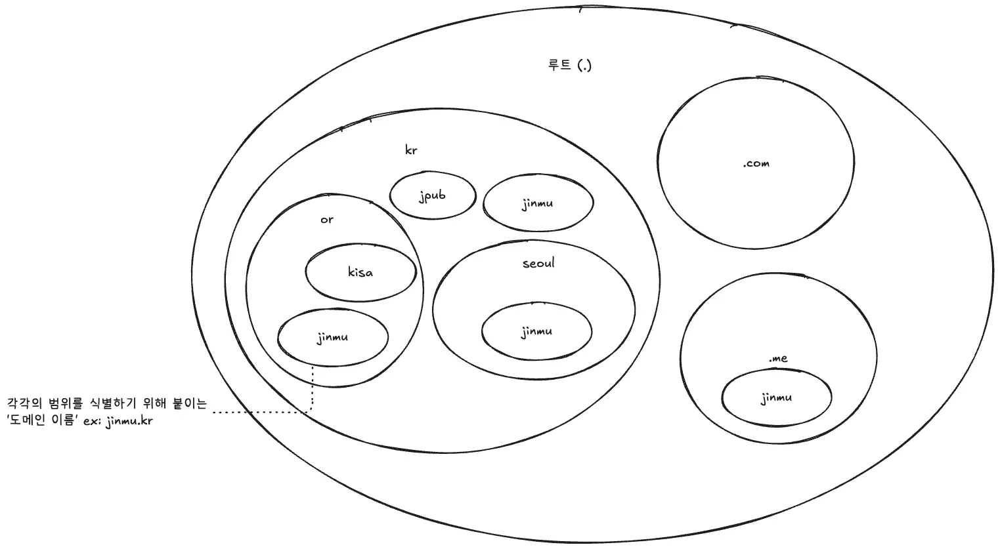
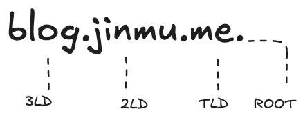
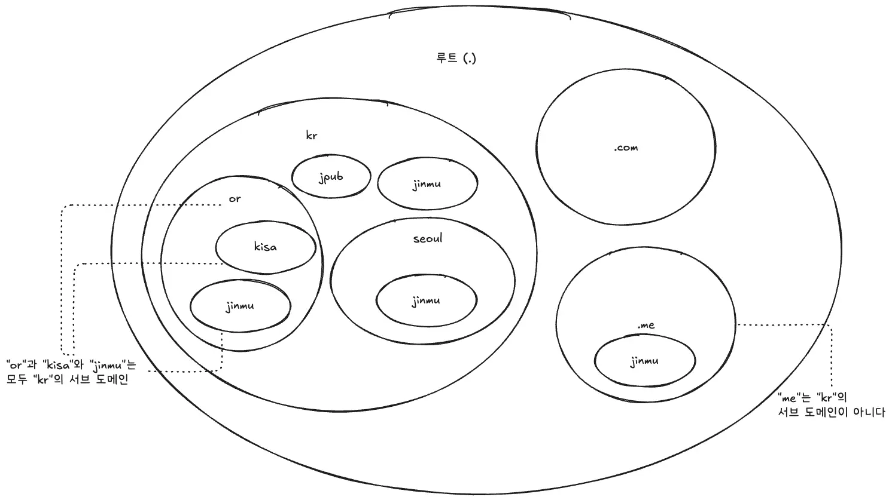
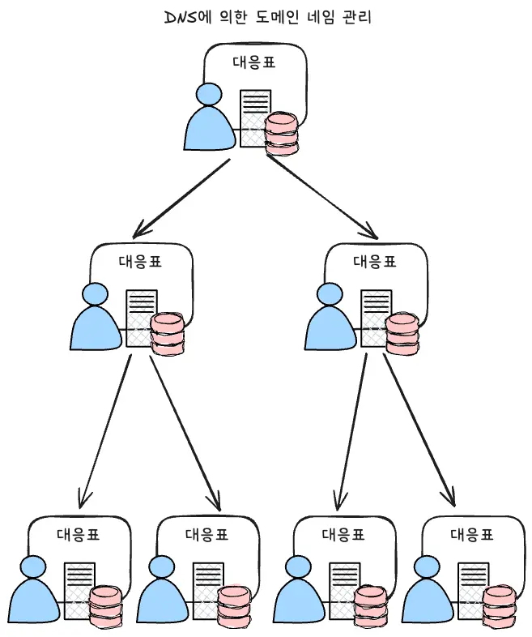

> The Internet is for Everyone

## Intro

I was browsing the Internet one day and was curious about the behavior of the Domain Name System (DNS). Not only was I curious about why DNS was created, but I was also curious about how it manages the different domains (.com, .net, .kr) that are out there today. I came across a book called The [DNS Practical Textbook](https://www.aladin.co.kr/shop/wproduct.aspx?ItemId=282893007&partner=openAPI&start=api), and I'm going to write a series of blogs based on it.

## IP addresses and names

There are tons of computers, smartphones, routers, and more connected around the world that are called "servers" that provide information or services to other computers. These networked computers are called **hosts**.

With so many computers connected, when hosts communicate with each other, they need to somehow specify who they are communicating with. Conversely, if the other host doesn't know who is communicating with them, it's hard for them to determine if they should or shouldn't allow the communication.

The Internet uses Internet Protocol (IP) addresses to do this. An IP address is an address used to identify someone to communicate with.

However, IP addresses are hard to memorize and easy to get wrong because they are a list of numbers, and they change from time to time due to administrative reasons. If you specify an old IP address without realizing it's changed, you might be connected to a completely different party.

To solve this problem, we came up with an easy-to-memorize and easy-to-use way to specify who you want to communicate with by **name**.

> [!note] Addressing and naming.
> Specifying who you want to communicate with, the sender or receiver, by an address according to a set of rules is called **addressing**, and giving a name to the person or service you want to communicate with and mapping it to an address is called **naming**.

## Manage the mapping of IP addresses to names

As described in the previous chapter, the Internet uses IP addresses to identify people on the Internet, but it's easier to use names when you're actually specifying who you want to communicate with. We've organized the correspondence between names and IP addresses into a table so that when you're specifying who you want to communicate with, you can just look up the IP address that corresponds to the name and not have to memorize the IP address.

In the early days of the Internet, this was accomplished by maintaining a text file called `HOSTS.TXT' that listed the IP addresses and name correspondences of all hosts connected to the Internet.

Because IP addresses must be unique across the Internet, it's important to keep track of which devices are using which IP addresses, so the `HOSTS` file is maintained by the Stanford Research Institute Network Information Center (SRI-NIC) to ensure that no names or numbers are duplicated. An organization that maintains a list of commonly used names or numbers across the Internet is called a registry.

At the time, organizations that wanted to connect to the Internet would apply to SRI-NIC, which would check and review each application, assign addresses, and register the results in the `HOSTS` file. The `HOSTS` file would then be made publicly available on the Internet, and users would download and use the file.

## From centralized to decentralized management

As the Internet evolved, the number of hosts wanting to connect to it increased the volume of applications for SRI-NICs, which gradually slowed down the process. It was clear that the growing number of organizations wanting to connect to the Internet would strain the management structure.

This is where the idea of a distributed management structure with layering and delegation came from.

### Tiering and delegation

The tiering and delegation mindset is used to manage large organizations like companies.
Companies create departments based on the type of work they do, and define the roles of each department to clarify the organizational structure. This is called "hierarchy." Then, they assign department heads to each department, and delegate management to them. This is delegation.
The modern Internet uses this structure of layering and delegation to manage the IP addresses and names of hosts.

The Internet shares one space, called a **name space**, across the board, so the structure was adopted to carve up parts of the name space and delegate the carved up name space to other trusted parties. **The delegating party only manages the information about who they delegated that name space to**, and the delegated party is responsible for managing that name space.

Introducing tiering and delegation has two advantages.

1. it reduces the burden on each administrator by decentralizing management.
2. it gives you the flexibility to respond to organizational growth and change.

This means that if the scope of management grows and becomes unmanageable, you can simply divide it up as needed and delegate it to new admins.
But what about duplication if this layering and delegation means that each administrator has a `HOSTS` file? As mentioned above, in the early days of the Internet, SRI-NICs were centralized so that there were no duplicate names or numbers.

To ensure that this advantage was not lost when we moved to a decentralized management scheme, it was designed as a tree structure with a single vertex. In a tree structure, you can ensure that your namespace is unique by managing duplicate names at each level of the tree as branches branch out.

> [!caution] What to watch out for with tiering and delegation
> While the benefits of introducing layering and delegation are great, the only way to achieve this decentralized management is to ensure that the organizations responsible for each layer are well managed and accountable for their portions.
> For example, it is possible to attack the DNS by intentionally and maliciously setting inappropriate settings for domain names such as [NXNSAttack](https://www.paloaltonetworks.co.kr/cyberpedia/what-is-an-nxnsattack).

## Configuration of domain names

On the Internet, the scope of each partitioned namespace is called a **domain**, and the name given to identify that scope is called a **domain name**.

### What is a domain name?

By organizing the names at each layer into a tree with no duplicates, domain names become unique on the internet. And by properly mapping these domain names to IP addresses, domain names can be used as an **identifier** to identify internet hosts.

For example, the `jinmu.me` part of `https://jinmu.me` is the `domain name`.

### Organization of a domain name

A domain name is made up of strings of characters concatenated with '.(dot)'. Each string is called a **label**. Actually, there is also a dot (.) at the end of the domain name, which is usually omitted. The dot at the end of a domain name represents the **root**, which is the apex of the hierarchy, and is called, in order from right to left, from the root, as follows

- TLD (Top Level Domain)
- 2nd Level Domain (2LD)
- 3rd Level Domain (3LD)

### subdomain

When the scope of one namespace falls within the scope of another namespace, it is called a **subdomain**.

Subdomains can be created freely by the administrator of that domain, and they can decide whether or not to delegate the subdomains they create to others.

## DNS created to use the domain name

**DNS** is short for Domain Name System. As a system developed under the premise of the introduction of domain names, DNS also adopts a decentralized management structure based on layering and delegation.

DNS manages the correspondence between domain names and IP addresses and finds the IP address that corresponds to a domain name at the request of a user. This is known as name resolution.

The primary goal of DNS is to follow the hierarchy of domain names, obtaining the necessary information from the administrators at each level, to reach its final goal: an IP address.

### The structure of DNS layering and delegation

DNS hierarchizes scopes of management in a way that corresponds to domain names, and distributes management by delegation. The scope of management made possible by delegation is called a zone. In DNS, the person who delegates (the delegator) and the person who is delegated to (the delegatee) have a parent-child relationship.

To delegate a zone, you first create a subdomain, which is created by the delegator. For example, if you create a subdomain under me and delegate it to someone else, you create a parent-child relationship where me is the parent and the delegate from me is the child. The administrator of each zone manages the information with a server called a name server.

There are two types of information managed by the name server, as shown below.

1. domain names and IP addresses of hosts in the zone.
   - The name servers in each zone manage the mapping of domain names to IP addresses.
2. delegation information
   - This is the name server information of the delegate (child), which is managed by the name server of the delegator (parent).

### Relationship between DNS and the registry

As described in [[#Managing the mapping of IP addresses to names]], management by the `HOSTS` file is a simple form of centralized management of names or numbers by a single registry (SRI-NIC). The introduction of domain names and DNS has reduced the burden on administrators and allowed for more flexible management, but it also means that there are now multiple registries managing names.

This hierarchy introduced by domain names and DNS requires an administrator (registry) to manage each layer. Each registry has two responsibilities

1. manage the zones they have been entrusted with (delegated).
2. if it delegates a zone, it manages who the zone is delegated to (the delegate).

For domain names and DNS as decentralized names to work smoothly as a whole, the registries that manage each zone and their stakeholders must be aligned and cooperative.

## Outro

We've seen why DNS was created, how it works, and how it is managed globally and distributed through layering and delegation. The evolution from a simple text file managing `HOSTS' to the sophisticated and scalable DNS system we have today is a testament to the growth of the Internet.

DNS isn't just a tool that turns domain names into IP addresses; it's the backbone of the Internet, allowing devices around the world to communicate seamlessly. The design philosophy of hierarchy and delegation, in particular, has allowed this vast system to operate flexibly and reliably. At the end of the day, for DNS to work well, it's important that the administrators at each layer do their job and work together. In this way, DNS is more than just a technology, it's a social commitment and a collaborative system.

In the next article, we'll take a deeper dive into registries, exploring the registry and registrar model, and the registration and use of domain names.

### Reference

- [DNS Practical Textbook](https://www.aladin.co.kr/shop/wproduct.aspx?ItemId=282893007&partner=openAPI&start=api)
