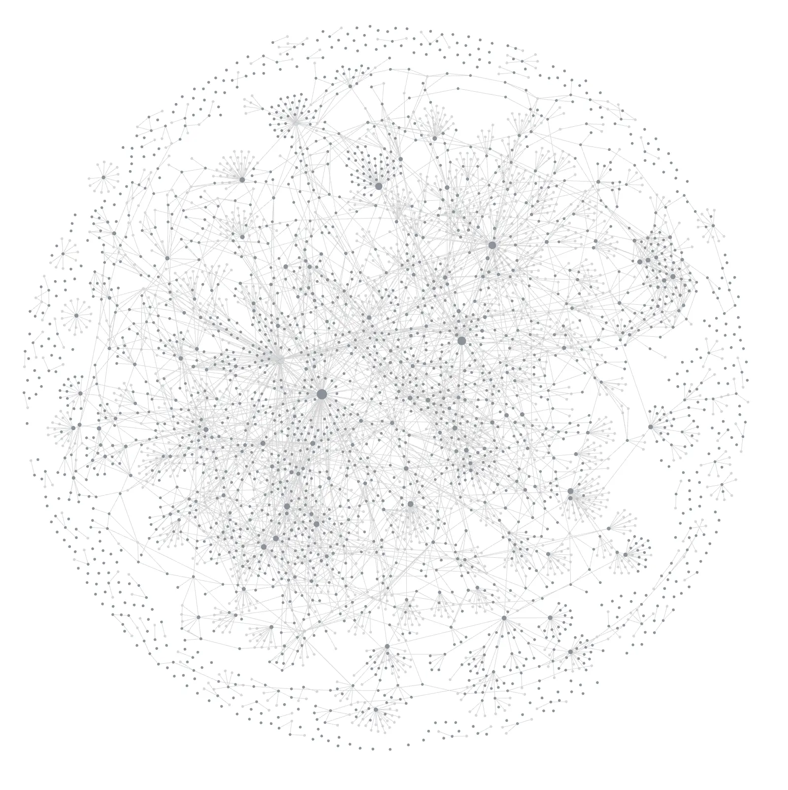
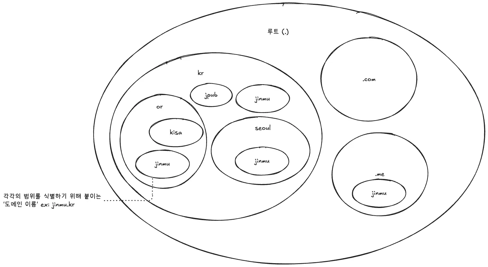
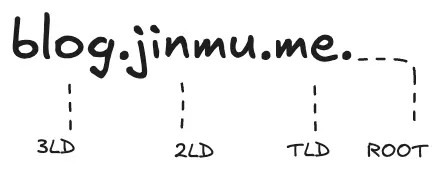
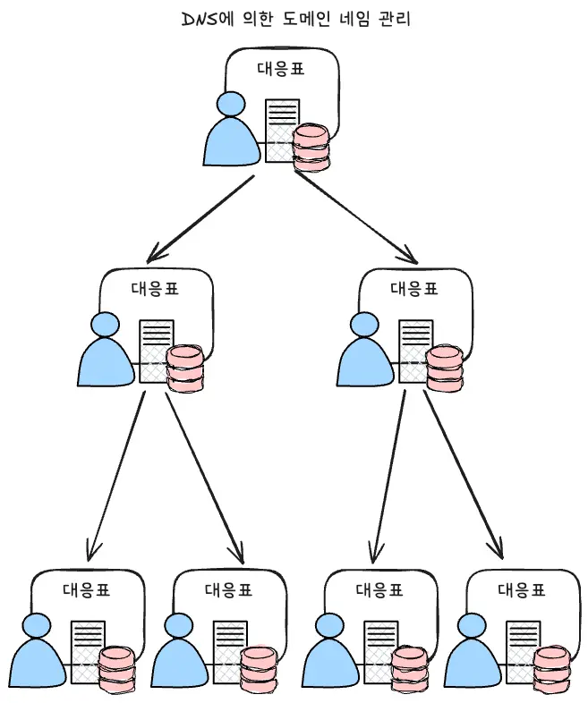

> The Internet is for Everyone

## Intro

문득 인터넷을 돌아다니다가 **DNS(Domain Name System)** 의 동작에 대해 궁금해졌습니다. 왜 DNS를 만든지도 궁금할 뿐더러 현재 퍼져있는 여러 도메인들(.com, .net, .kr)을 어떻게 관리하는지도 궁금했습니다. 그러던 중 마침 [DNS 실전 교과서](https://www.aladin.co.kr/shop/wproduct.aspx?ItemId=282893007&partner=openAPI&start=api)라는 책을 발견하여 이 책을 기반으로 시리즈로 블로그에 정리해보려 합니다.

## IP주소와 이름

전 세계에는 다른 컴퓨터에 정보나 서비스를 제공하는 '서버'라고 불리는 컴퓨터와 스마트폰, 라우터 등 수 많은 컴퓨터가 연결되어 있습니다. 이렇게 네트워크에 연결된 컴퓨터를 가리켜 **호스트(hosts)** 라고 부릅니다.

이렇게 많은 컴퓨터가 연결되어 있다 보니 호스트끼리 통신할 때는 통신할 상대를 어떻게든 지정해야 합니다. 또 반대로 상대 호스트 입장에서 봤을 때 누가 통신을 해왔는지 알 수 없다면 해당 통신을 허용해도 되는지 안 되는지를 판별하기 어렵습니다.

인터넷에서는 이때 **IP(Internet Protocol)주소**를 사용합니다. IP주소는 통신할 상대를 식별할 때 사용되는 주소입니다.

하지만 IP주소는 숫자의 나열로 되어 있어 외우기 어렵고 틀리기 쉽습니다. 또 IP주소는 관리하는 쪽의 사정으로 때때로 변하기도 합니다. 만약 변경된 것을 모르고 이전 IP 주소를 지정하게 되면 완전히 다른 상대와 연결될 수도 있습니다.

이런 불편을 해소하기 위해 외우기 쉽고 사용하기 쉬운 **이름(name)** 으로 통신할 상대를 지정하는 방법이 고안되었습니다.

> [!note] 어드레싱과 네이밍
> 정해진 규칙에 따른 주소로, 통신할 상대인 송신자나 수신자를 지정하는 것을 **어드레싱(addressing)**이라고 하고 통신할 상대나 서비스에 이름을 붙이고 주소와 매핑하는 것을 **네이밍(naming)**이라고 합니다.

## IP주소와 이름의 매핑을 관리하자

앞 장에서 설명한 것과 같이 인터넷에서는 **IP주소로 상대를 식별**하지만, 실제로 **통신할 상대를 지정할 때**는 이름을 사용하면 편합니다. 그래서 이름과 IP주소의 대응을 하나의 표로 정리해 두면 상대를 지정할 때 이름에 대응하는 IP주소를 찾기만 하면 되어 IP주소를 일일이 외우지 않아도 됩니다.

인터넷 초기 시절에는 이를 위한 표로 `HOSTS.TXT`라는 텍스트파일에 인터넷에 연결된 모든 호스트의 IP주소와 이름의 대응을 기재하여 관리했습니다.

IP 주소는 인터넷 전체에서 고유한 번호여야 하므로 어느 기기가 어느 IP주소를 사용 중인지 통일성 있게 관리해야 합니다. 그렇기에 `HOSTS`파일은 이름이나 번호가 중복되지 않도록 SRI-NIC(Stanford Research Institue Network Information Center)에서 일원화 관리를 했습니다. 이처럼 인터넷에서 공통으로 사용되는 이름이나 번호를 일원화 관리하는 조직을 **레지스트리(registry)**라고 합니다.

당시 인터넷에 접속하고 싶은 조직은 SRI-NIC에 접속 신청을 했습니다. 그러면 SRI-NIC이 각 조직의 신청 내용을 확인하고 심사해 주소를 할당하고 그 결과를 `HOSTS`파일에 등록했습니다. 그리고 `HOSTS`파일을 인터넷에 공개하고 이용자는 그 파일을 다운로드해서 사용하는 방식이 기본이었습니다.

## 집중 관리에서 분산 관리로.

인터넷이 발전함에 따라 접속하려는 호스트의 수가 늘어나면서 SRI-NIC에 신청하는 양이 많아졌고, 점차 처리 속도가 늦어졌습니다. 인터넷에 접속하고 싶은 조직이 이대로 증가하게 되면 관리 구조에 한계가 올 것은 자명했습니다.

이런 고민에서 나온 것이 바로 **계층화**와 **위임**을 통한 분산 관리 구조입니다.

### 계층화와 위임

계층화와 위임이라는 사고방식은 회사처럼 규모가 있는 조직을 관리할 때 사용합니다.
회사에서는 업무 종류에 따라 부서를 만들고, 각 부서의 역할을 정해 조직 체계를 명확히 합니다. 이것이 '계층화'입니다. 그리고 각 부서의 부서장을 정하고 부서장에게 관리를 맡깁니다. 이것이 '위임'입니다.
현대 인터넷 체계는 이러한 계층화와 위임의 구조를 이용해 호스트의 IP주소와 이름을 관리합니다.

인터넷에서는 **네임 스페이스(name space)** 라고 불리는 하나의 공간을 전체에서 공유하고 있습니다. 그래서 네임 스페이스의 일부를 분할하고, 잘라낸 네임 스페이스를 신뢰할 수 있는 다른 사람에게 위임하는 구조가 채택되었습니다. **위임한 쪽에서는 그 네임 스페이스를 누구에게 위임했는지에 대한 정보만 관리**하고, 해당 네임 스페이스의 관리 책임은 위임받은 쪽이 갖게 됩니다.

계층화와 위임을 도입하면 다음과 같은 두 가지 장점이 있습니다.

1. 관리를 분산하기 때문에 각 관리자의 부담을 줄일 수 있다.
2. 조직의 성장 및 변화에 유연하게 대응할 수 있다.

즉, 관리 범위가 커져서 관리가 어렵게 되면 그 범위를 필요에 따라 분할하고 새로운 관리자에게 위임하기만 하면 됩니다.
그런데 이렇게 계층화와 위임을 해서 각각의 관리자에게 `HOSTS`파일을 갖게 한다면 중복문제는 어떻게 할까요? 전술했듯이 초창기 인터넷에선 SRI-NIC가 이름이나 번호가 중복되지 않도록 일원화 관리를 했습니다.

분산 관리 체계로 바뀌더라도 이 장점을 잃지 않도록 **하나의 정점을 두는 트리구조**로 설계되었습니다. 트리 구조에서는 가지가 뻗어 나간 쪽의 각 계층에서 이름이 중복되지 않도록 관리하여 네임 스페이스 고유한 이름을 갖도록 보장할 수 있습니다.

> [!caution] 계층화와 위임에서 주의할 점
> 계층화와 위임을 도입해서 얻는 장점은 크지만, 이러한 분산관리를 실현하기 위해서는 각 계층을 담당하는 기관이 자신이 담당하는 부분을 잘 관리하고 책임을 다한다는 전제가 필요합니다.
> 예를들어, [NXNSAttack](https://www.paloaltonetworks.co.kr/cyberpedia/what-is-an-nxnsattack) 과 같은 도메인 이름에 악의를 가지고 의도적으로 부적절한 설정을 하여 DNS를 공격할 수 있습니다.

## 도메인 이름의 구성

인터넷에서는 분할된 각 네임 스페이스의 범위를 **도메인(domain)**, 그 범위를 식별하기 위해 붙여진 이름을 **도메인 이름(domain name)**이라고 부릅니다.

### 도메인 이름이란?

각 계층의 이름을 중복되지 않게 트리 형태로 관리하면 도메인 이름은 인터넷상에서 고유해집니다. 그리고 이런 도메인 이름과 IP 주소를 적절히 매핑하면 도메인 이름을 인터넷 호스트를 특정하기 위한 **식별자**로 사용할 수 있게 됩니다.

예를들어, `https://jinmu.me`에서 `jinmu.me`부분이 '도메인 이름'입니다.

### 도메인 이름의 구성

도메인 이름은 문자열을 '.(dot)'으로 연결한 형태로 구성됩니다. 각각의 문자열을 **라벨(label)** 이라고 합니다. 사실, 도메인 이름의 마지막에도 점(.)이 붙어있는데 보통은 생략합니다. 도메인 이름의 마지막에 붙여진 점은 계층 구조의 정점인 **루트(root)** 를 나타내며, 루트를 기준으로 오른쪽에서 순서대로 다음과 같이 부릅니다.

- TLD(Top Level Domain)
- 2LD(2nd Level Domain)
- 3LD(3rd Level Domain)

### 서브 도메인(subdomain)

어떤 네임 스페이스의 범위가 다른 네임 스페이스의 범위에 속할 때 **서브 도메인**이라고 합니다.

서브 도메인은 해당 도메인의 관리자가 자유롭게 만들 수 있습니다. 그리고 만든 서브 도메인을 다른 사람에게 위임할지에 대한 여부도 정할 수 있습니다.

## 도메인 이름을 사용하기 위해 생긴 DNS

**DNS**는 `Domain Name System`의 줄임말입니다. 도메인 이름의 도입을 전제로 하여 개발된 시스템이기에 DNS도 계층화와 위임에 의한 분산 관리 구조를 채택했습니다.

DNS는 도메인 이름과 IP주소의 대응을 관리하고 이용자의 요청에 따라 도메인 이름에 대응하는 IP주소를 찾습니다. 이것을 **이름 풀이(Name Resolve)** 라고 합니다.

DNS의 기본 목표는 각 계층의 관리자로부터 필요한 정보를 얻어 도메인 이름의 계층 구조를 따라가, 최종 목적인 IP 주소를 얻는 것입니다.

### DNS 계층화와 위임의 구조

DNS에서는 도메인 이름에 대응하는 형태로 관리 범위를 계층화하고, 위임해서 관리를 분산합니다. 위임에 의해 관리하게 된 범위를 존(zone)이라고 합니다. DNS에서 위임한 사람(위임자)과 위임받은 사람(위임처)은 부모와 자식 관계가 됩니다.

존을 위임하기 위해서는 우선 서브 도메인을 만드는데, 위임자가 만듭니다. 예를 들어, me에 서브 도메인을 만들고 다른 사람에게 위임합니다. 그러면 `me`이 부모가 되고 `me`로부터 위임받은 위임처는 자식이 되는 **부모-자식 관계**가 성립합니다. 그리고 각 존의 관리자는 **네임 서버**라는 서버로 정보를 관리합니다.

네임 서버가 관리하는 정보는 아래와 같이 두 종류입니다.

1. 존에 존재하는 호스트의 도메인 이름과 IP주소
   - 각 존의 네임 서버가 도메인 이름과 IP주소의 매핑을 관리합니다.
2. 위임 정보
   - 위임처(자식)의 네임 서버 정보로, 위임자(부모)의 네임 서버가 관리합니다.

### DNS와 레지스트리의 관계

[[#IP주소와 이름의 매핑을 관리하자]]에서 설명했듯이 `HOSTS` 파일에 의한 관리는 하나의 레지스트리(SRI-NIC)가 이름이나 번호를 일원화 관리하는 간결한 형태를 가집니다. 도메인 이름과 DNS를 도입하는 것으로 관리자의 부담을 줄이고 보다 유연한 관리를 실현할 수 있지만 이는 이름을 관리하는 레지스트리가 여러 개 생겨난 것을 의미합니다.

이처럼 도메인 이름과 DNS에 의한 계층 구조를 도입한 경우, 각 계층을 관리하는 관리자(레지스트리)가 필요합니다. 각 레지스트리는 다음과 같은 두 가지 책임이 있습니다.

1. 자신이 맡게된(위임받은)존을 관리한다.
2. 존을 위임한 경우, 그 존을 위임받은 사람(위임처)이 누구인지를 관리한다.

분산화된 이름인 도메인 이름과 DNS가 전체적으로 원활하게 작동하기 위해서는 각 범위를 관리하는 레지스트리와 그 관계자가 연계하고 협조해야 합니다.

## Outro

지금까지 DNS가 왜 만들어졌고, 어떻게 작동하는지, 계층화와 위임을 통해 어떻게 전 세계적으로 분산 관리되고 있는지를 살펴봤습니다. 단순한 텍스트 파일 하나로 시작했던 `HOSTS` 관리 방식에서 지금의 정교하고 확장성 높은 DNS 시스템으로 발전해 온 걸 보면, 인터넷의 성장과 함께 얼마나 큰 진화를 거쳤는지 실감할 수 있죠.

DNS는 그저 도메인 이름을 IP주소로 바꿔주는 도구가 아닙니다. 전 세계의 기기들이 문제없이 통신할 수 있게 해주는 인터넷의 뼈대 같은 존재인 것 같습니다. 특히 계층 구조와 위임이라는 설계 철학 덕분에, 이 방대한 시스템이 유연하면서도 안정적으로 운영될 수 있었습니다. 결국 DNS가 잘 작동하기 위해선 각 계층의 관리자들이 제 역할을 해내고, 서로 협력하는 게 중요합니다. 이걸 보면 DNS는 단순히 기술을 넘어서, 일종의 사회적 약속이자 협업 시스템이라고도 할 수 있겠습니다.

다음 글에선 레지스트리에 대해 더 깊게 살펴보고 레지스트리⋅레지스트라 모델, 도메인 이름의 등록과 사용에 대해 알아보겠습니다.

### Reference

- [DNS 실전 교과서](https://www.aladin.co.kr/shop/wproduct.aspx?ItemId=282893007&partner=openAPI&start=api)
