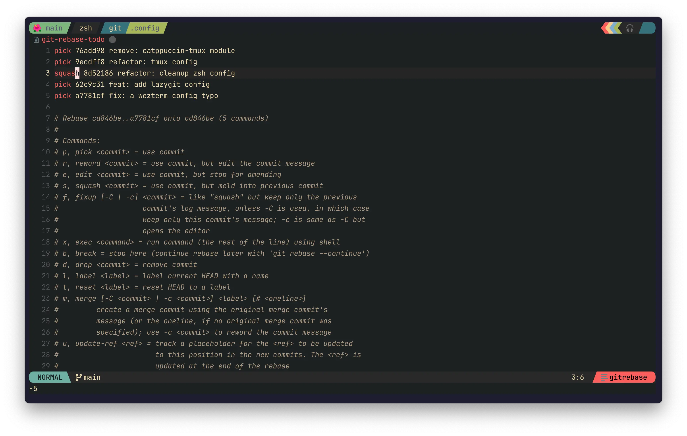
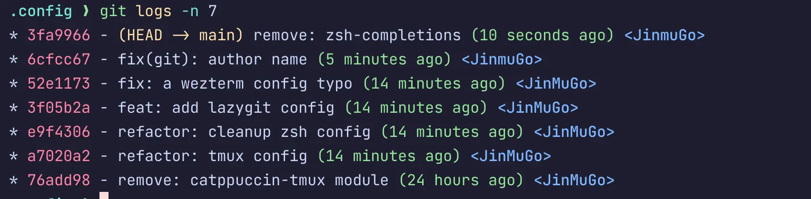

## Intro

In my workflow using `git`, I often use the interactive rebase (`git rebase -i`) feature to clean up commits before pushing to remote. It's a great way to look back at what you've done so far and make sure your commits are in meaningful chunks. In the past, I've only used `squash` to combine multiple commits into one, because I thought that was all there was to it 😅 But this time, while using `lazygit`, I discovered the `fixup` command. It did something, and it was exactly what I was looking for while using `squash`. Today I'm going to compare `squash` and `fixup`, the commands you can use during Interactive Rebase, and see when you should use them.

![[git-squash-vs-fixup-1752198125071.webp]]

This is the `interactive` screen that comes up when you type `git rebase -i`. As you may have noticed, you can do anything you want with a commit by prefixing it with a command. You can use `squash` and `fixup` to do this.

## `squash` (or `s`)

- Function:\*\* Merges the commit with the previous commit.
- Handles commit messages:\*\* Opens an editor to edit the messages of all the commits being merged, meaning it shows both the previous and current commit messages, and allows the user to combine them or create new ones.
- Key uses:\*\* This is useful when you want to combine multiple small feature additions or refactoring commits into one large, meaningful feature commit, or when you want to organize multiple fix commits into one clean commit while leaving a unified message about what they are.

<div class="image-row">




</div>

## `fixup` (or `f`)

- Function:\*\* Merge the current commit with the previous commit (same function as `squash`).
- Commit message handling:** Discard the current commit's messages, **keeping only the previous commit's messages\*\*. Messages are processed automatically without opening a separate editor.
- Key uses:\*\* When making a commit that supplements or corrects a previous commit, such as fixing typos, fixing very small bugs, or missing minor changes in a previous commit. This is appropriate when a new commit message is unnecessary and the message in the original commit describes the change well. Creating a commit with the command `git commit --fixup <commit-hash>` automatically generates a commit message prefixed with `fixup!`, which is very convenient when used with `git rebase --autosquash`.

## Example

If you have these commits that have not yet been pushed to remote, you can use the

<div class="image-row">

![[git-squash-vs-fixup-1752199918988.webp]]
![[git-squash-vs-fixup-1752199951224.webp]]

</div>

I want to modify lazygit's config and merge it into commit `3f05b2a`.

```text
* 3fa9966 - (HEAD -> main) remove: zsh-completions (46 seconds ago) <JinmuGo>
* 6cfcc67 - fix(git): author name (6 minutes ago) <JinmuGo>
* 52e1173 - fix: a wezterm config typo (14 minutes ago) <JinMuGo>
* 3f05b2a - feat: add lazygit config (14 minutes ago) <JinMuGo> // [!code highlight]
* e9f4306 - refactor: cleanup zsh config (14 minutes ago) <JinMuGo>
* a7020a2 - refactor: tmux config (15 minutes ago) <JinMuGo>
* 76add98 - remove: catppuccin-tmux module (24 hours ago) <JinMuGo>
```

At this point, I stage the fixup file and run `git commit --fixup 3f05b2a`, which will result in the

![[git-squash-vs-fixup-1752200222658.webp]]

This will create a commit named `fixup! feat: add lazygit config`. As you can see here, `--fixup` is just a simple template command to make it easy to use the `fixup` feature in our commit messages, and we could have created our own by adding the `fixup!

Commits with the fixup! prefix will be merged into that commit when git rebase interactive. If you type `git rebase -i --autosquash`, it will automatically analyze the list of commits and move the commits with the `fixup!` or `squash!` prefix directly below the target commit and change the action to `fixup` or `squash` instead of `pick`.

![[git-squash-vs-fixup-1752200853821.webp]]

And when you save and exit
![[git-squash-vs-fixup-1752201099133.webp]]

So you can see that the commits I modified are neatly merged together.

## Summary comparison

| Features             | `squash`                                                        | `fixup`                                                            |
| -------------------- | --------------------------------------------------------------- | ------------------------------------------------------------------ |
| **Merging**          | Merges with previous commits                                    | Merges with previous commits                                       |
| **Message Handling** | Combine all merged commit messages into a single, editable file | Discard current commit message and keep previous commit messages   |
| **Editor**           | Opens                                                           | Does not open                                                      |
| **Main uses**        | Meaningfully combine content and messages from multiple commits | Minor fixes/complements to previous commits (no messages required) |

> [!note] 💡 Notes.
> Interactive rebase also allows commands such as `edit` (to modify a commit), `drop` (to delete a commit), and `reword` (to modify only the message).

## Helpful tips

1. Make `--autosquash` the default setting
   - If you find it annoying to type `--autosquash` every time, you can make it the default behavior with a Git configuration
   - `git config --global rebase.autoSquash true`
2. alias for quick fixup commits
   - `git config --global alias.fixup 'commit --fixup'`
   - Now it's as simple as `git fixup <commit-hash>`!

## Outro

Now that I have a clearer understanding of the difference between `squash` and `fixup`, I used to only use `squash` to combine all commits together, but I think `fixup` is actually more appropriate in most cases, especially for typo fixes and small bug fixes, where I don't need to re-edit the commit message.

And the combination of `git commit --fixup` and `git rebase --autosquash` is really powerful. I think a workflow where I immediately make a `fixup` commit when I find a mistake as I'm working, and then clean it up in one go later, would keep my commit history much cleaner.

In the future, I'll try to use `squash` and `fixup` separately depending on the situation, and I hope you'll consider the difference between the two commands when cleaning up your commits to create a more efficient Git workflow! 🚀 I'm sure you'll agree!
