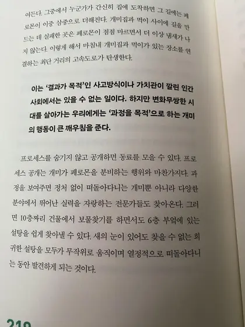

## 더 이상 품질만으로는 차별성을 갖기 어렵다.

우리는 하루하루가 급변하는 시대에 살고 있다. 눈 깜짝할 사이에 정보가 퍼져나가고 어느 명품 브랜드의 신제품이 출시되자마자 금세 모조품이 나온다.
이 책을 쓴 작가는 '더 이상 품질만으로는 차별성을 갖기 어려워졌다'라고 말한다.
기술의 발전으로 인해 어느 한 콘텐츠가 트렌드가 되면 그와 비슷하게 따라한 결이 비슷한 콘텐츠가 재생산되는 것을 볼 수 있다.
트로트가 제2의 전성기를 맞이한 것도 이러한 경향이 일조를 하였을 것이다.

음식점의 예시도 그렇다. 요즘엔 어떤 식당에 들어가도 어느 정도 적당한 맛의 수준은 유지하는 것 같다. 여러 가지 이유가 있겠지만 **프로세스 이코노미**의 관점에서 설명해보자면 인터넷에 식당 운영법이나 맛있는 음식을 만드는 법에 관한 정보가 현저히 많아졌다.
뛰어난 정보가 인터넷을 통해 사람들에게 유통되면서 전체적인 식당의 수준이 올라간 것이다.

지금 당장 유튜브에 들어가 '\~\~\~하는 법'이라고 검색을 한다면 관련 정보에 관한 영상을 수십 개 볼 수 있다.
이렇게 각자가 만드는 아웃풋의 차이가 점차 줄어들면서 사람들은 이제 과정(프로세스)와 이야기에 주목하기 시작한다.
일정 수준의 품질을 충족한다면 더욱 과정과 이야기에 감응하는 쪽으로 해당 브랜드를 소비한다.
이러한 소비 패턴에는 젊은 세대의 가치관이 작용한 것처럼 보인다.

## 욕망하지 않는 세대.

이러한 30대 이하의 젊은 세대를 작가는 "**욕망하지 않는 세대**"라 칭한다.
이십대 중반인 나의 예시로만 보아도 옛날 우리 부모님 시대와 비견해 물질적으로는 부족함을 느끼지 못한 것 같다.
부모님 시대는 살아남는 것 자체에 집중하였다면, 이제 우리가 살아가는 시대는 조금 더 높은 차원의 성취를 욕망한다.
이러한 관점에서 본다면 욕망하지 않는 세대가 아니라 이전 세대와는 다른 것을 욕망하는 세대라고도 볼 수 있겠다.
우리 세대는 더 이상 성취와 쾌락 같은 1차원적인 욕구를 이전 세대에 비해 다른 양상을 보인다.
그보다는 자신이 진심으로 좋아하는 물건, 기업의 비전과 생산자의 삶과 스토리에 공감하여 그로 인해 생산된 물건을 사고 싶어 한다.

> [!note]
> 단순한 "아웃풋"을 소비하는 것이 아니라. "프로세스"를 공유하는 그 행위 자체에 매력을 느끼는 것이다.

## 오케스트라형 대신 재즈형일하기 방식으로.

오케스트라는 약속의 음악이다. 사전에 정해진 대로 관악기와 타악기 모든 연주자들이 지휘자의 리듬에 맞추어 연주를 진행한다. 작가는 오케스트라 연주가 정해진 목표로 달리는 정답 주의의 전형이라 일컫는다. 악보를 벗어난 애드리브는 오케스트라에선 허용되지 않는다.

반면, 재즈는 그야말로 정반대의 스타일이다. 작곡가의 악보를 따르긴하지만 그날의 기분, 분위기에 따라 연주자의 연주는 천차만별로 달라질 수 있다. 작가는 하루가 다르게 변하는 시대 상황에 맞추어, 정해진 목표를 향해 올곧게 진행하는 오케스트라 형이 아닌 어디에 정답이 있는지 모른 채 답을 찾아 떠나는 재즈형 생활 방식과 작업 방향이 더 바람직하다 말한다.

현실의 불확실속에서 결과를 도출해내기 까지의 시간은 너무 오래 걸린다. 재즈는 그 순간의 합을 그때그때 맞추어 청중에게 들려주어야 한다. 어떤 소리가 청중에게 닿을지는, 어떤 노래가 나올지는 모른다. 그저 그 순간의 노래와 연주를 즐길 뿐이다. 관객들은 과정을 즐기는 연주자들의 모습을 보며 형용할 수 없는 아름다움과 기쁨을 느낀다.

## 새로운 정보를 나만알고 있다는 생각은 이미 틀렸다.

> [!note]
>
> 정보 자체에는 더 이상 큰 가치가 없다. 오히려 내가 가진 정보를 공유하여 동료를 만들고, 프로세스를
> 아낌없이 공개하는 편이 결과적으로는 더 많은 핵심 정보를 모으는데 유리하다.

이 말이 참 공감되었다. 프로그래밍도 이러한 과정의 공유를 통해 빠르게 성장할 수 있었다. 모두 자기의
문제와 기술을 공유하고 함께 성장함으로써 많은 발전을 이룩할 수 있었다. 나도 공부하다 새로운 정보를
얻게 되는 경우가 있다. 이때, 이 사실을 알기 이전에는 이 간극을 이용해 남들보다 앞서 나가려고 하였다.
중, 고등학교, 대학생 때에도 그러하였다. 하지만 살아가다가 어느 순간 깨닫게 되었다. 더 이상 새로운
정보는 없다. 오히려 내가 얻어낸 이 사실을 얻어낸 과정을 공유하면서 함께 다음을 생각하면서 더 많은
정보를 얻을 수 있었다. 저자는 말한다.

> [!note]
> 선두주자에게는 많은 관심이 쏠린다. 그리고 그를 중심으로 다양한 정보와 사람이 모여들기 시작한다.
> 여기에 많은 사람의 생각이 더해지면서 정보는 배로 늘어난다. 결국 처음 깃발을 세운 사람이 가장 많은
> 정보를 얻게 되는 것이다.

이 책을 읽으며 이 사실을 다시한번 상기할 수 있었다. 정보는 눈덩이처럼 처음 눈을 뭉친 사람에게 많은
사람들이 붙어 눈처럼 불어난다. 그것들을 함께 굴려가며 우리는 성장한다.

## 일개미는 어떻게 설탕을 찾아낼까.

생명은 참 신비롭다. 눈도 나쁘고 후각도 그리 좋지 않은 일개미가 어떻게 최단거리로 설탕을 찾아낼 수 있을까. 수천수만 마리의 개미들이 모여 길을 잃어버리고 다시 페로몬을 잇는 과정을 통해 가능하게 한다. 더 자세한 내용은 책에서 확인할 수 있다. 개미들의 이 과정(프로세스)은 작가가 말하는 프로세스의 개념과 정확히 일치한다. 자신이 찾아낸 경로를 공유하는 과정을 통해 개미와 우리는 여러 일들을 함께 이루어 낼 수 있다.

전체적으로 책이 프로세스에 대한 하나의 큰 줄기를 연속적으로 말하는 것이 아닌, 프로세스라는 주제를 가진 여러 글들을 모아놓은 듯한 느낌이 들었다. 그렇기 때문에 넓고 얕은 프로세스에 대한 이해를 할 수 있었다. 작가가 말하는 프로세스 이코노미에 대해서는 어렴풋이 알 수 있었지만 무언가 아쉬웠다. 하지만 지금을 살아가는 우리에게는 이 정도 정보만으로도 충분하지 않을까 생각한다. 이 책 역시 프로세스 이코노미의 한 단면일 뿐이기 때문에. 아직 완전한 결과물은 아닐지라도 작가의 과정을 공유함으로써 나는 또다시 새로운 세계를 알게 되었다. 삶이라는 과정 속에서 한 사람의 과정에 대한 과정을 알고 싶다면 짬짬이 읽어보는 것을 추천한다. 한 가지 확신할 수 있는 건 읽지 않는 것보다는 읽는 것이 더 재미있는 과정이 될 것이다.

 
